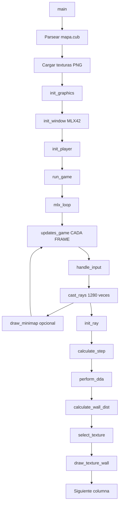

# 📚 Guía Completa del Motor de Raycasting - cub3D

## 📋 Índice

1. Introducción al Raycasting
2. Arquitectura General del Proyecto
3. Flujo de Ejecución Completo
4. Inicialización del Sistema
5. Sistema de Jugador y Cámara
6. Motor de Raycasting - Núcleo
7. Sistema de Texturas
8. Sistema de Renderizado
9. Sistema de Movimiento
10. Sistema de Minimapa
11. Game Loop Principal
12. Matemáticas del Raycasting Explicadas

---

## 1. Introducción al Raycasting

### 1.1 ¿Qué es el Raycasting?

El **raycasting** es una técnica de renderizado 3D simplificada utilizada en juegos clásicos como **Wolfenstein 3D** (1992) y **Doom** (1993). No es verdadero 3D, sino una proyección **2.5D**:

```
Vista 2D (Mapa):          Vista 3D (Jugador):
┌─────────────────┐       ╔═══════════════════╗
│ 1 1 1 1 1 1 1 1 │       ║                   ║
│ 1 0 0 0 0 0 0 1 │       ║    ▓▓▓▓▓▓▓▓▓     ║
│ 1 0 1 0 0 1 0 1 │       ║   ▓▓▓▓▓▓▓▓▓▓▓    ║
│ 1 0 0 0 N 0 0 1 │  -->  ║  ▓▓▓▓▓▓▓▓▓▓▓▓▓   ║
│ 1 0 1 0 │ 1 0 1 │       ║ ▓▓▓▓▓▓▓▓▓▓▓▓▓▓▓  ║
│ 1 0 0 0 ↓ 0 0 1 │       ║▓▓▓▓▓▓▓▓▓▓▓▓▓▓▓▓▓ ║
│ 1 1 1 1 1 1 1 1 │       ╚═══════════════════╝
└─────────────────┘       Textura proyectada
```

**Concepto clave:** Por cada columna vertical de píxeles en la pantalla, lanzamos UN rayo que detecta la primera pared que encuentra.

---

### 1.2 Principios Fundamentales

#### A) Sistema de Coordenadas

```
Y (filas del mapa)
↓
0 ────────────────> X (columnas del mapa)
│ 1 1 1 1 1 1 1 1
│ 1 0 0 0 0 0 0 1
│ 1 0 1 0 0 1 0 1
│ 1 0 0 0 N 0 0 1    N = Jugador mirando Norte
│ 1 0 1 0 0 1 0 1    Posición: (4.5, 3.5)
│ 1 0 0 0 0 0 0 1    Dirección: (0, -1)
│ 1 1 1 1 1 1 1 1
```

**Importante:**
- `map[y][x]` → Primero fila (Y), luego columna (X)
- Posiciones con `.5` → Centro de la celda
- Coordenadas con decimales → Movimiento suave

#### B) Vector Dirección y Plano de Cámara

```
        Plano de cámara (FOV)
              ↙     ↘
         ●─────────●
        /           \
       /             \
      /      FOV      \
     /     (66°)       \
    ●                   ●
     \                 /
      \               /
       \    dir →    /
        \           /
         ●─────────●
           Jugador
```

**Vectores clave:**
```c
// Vector dirección (hacia donde mira)
dir_x = 0.0, dir_y = -1.0  // Norte ↑

// Plano de cámara (define FOV)
plane_x = 0.66, plane_y = 0.0  // Perpendicular a dir
```

**Relación matemática:**
```
FOV = 2 × arctan(|plane| / |dir|)
FOV = 2 × arctan(0.66 / 1.0) ≈ 66°
```

---

## 2. Arquitectura General del Proyecto

### 2.1 Estructura de Archivos

```
cub3D/
├── srcs/
│   ├── execution/
│   │   ├── init.c              → Inicialización MLX42
│   │   ├── player.c            → Posición y orientación del jugador
│   │   ├── raycasting.c        → Algoritmo DDA principal ⭐
│   │   ├── raycast_texture.c   → Selección de texturas
│   │   ├── raycast_render.c    → Dibujado de columnas
│   │   ├── moves.c             → Movimiento WASD + ratón
│   │   ├── game_loop.c         → Loop principal MLX42 ⭐
│   │   ├── minimap.c           → Minimapa dinámico
│   │   └── utils_minimap.c     → Utilidades del minimapa
│   └── parser/
│       ├── walls.c             → Validación de colisiones ⭐
│       └── ...
└── includes/
    └── cub3d.h                 → Estructuras y constantes
```

---

### 2.2 Estructuras de Datos Principales

#### **`t_game` - Estado Global del Juego**

```c
typedef struct s_game
{
    // MLX42
    mlx_t           *mlx;              // Instancia MLX42
    mlx_image_t     *img;              // Buffer de píxeles principal
    
    // Jugador
    t_player        player;            // Posición, dirección, FOV
    
    // Mapa
    char            **map;             // Mapa 2D ['1', '0', 'N', etc.]
    int             map_width;         // Ancho del mapa
    int             map_height;        // Alto del mapa
    
    // Texturas
    t_textures      textures;          // 4 texturas (N, S, E, W)
    uint32_t        ceiling_color;     // Color techo (RGBA)
    uint32_t        floor_color;       // Color suelo (RGBA)
    
    // UI
    int             show_minimap;      // Toggle minimapa (SPACE)
    int             mouse_locked;      // Bloqueo ratón (TAB)
    
} t_game;
```

#### **`t_player` - Datos del Jugador**

```c
typedef struct s_player
{
    // Posición en el mapa (coordenadas reales)
    double      x;                     // Posición X (4.5 = centro de celda 4)
    double      y;                     // Posición Y
    
    // Vector dirección (normalizado)
    double      dir_x;                 // Componente X de dirección
    double      dir_y;                 // Componente Y de dirección
    
    // Plano de cámara (define FOV)
    double      plane_x;               // Componente X del plano
    double      plane_y;               // Componente Y del plano
    
    // Control de ratón
    double      mouse_x;               // Última posición X del ratón
    int         first_mouse;           // Flag primer movimiento
    
} t_player;
```

**Ejemplo de configuración (mirando Norte):**
```c
player.x = 4.5;           // Centro de celda X
player.y = 3.5;           // Centro de celda Y
player.dir_x = 0.0;       // Sin componente X
player.dir_y = -1.0;      // Componente Y hacia arriba (Norte)
player.plane_x = 0.66;    // Plano perpendicular
player.plane_y = 0.0;     // Sin componente Y
```

#### **`t_ray` - Datos de un Rayo**

```c
typedef struct s_ray
{
    // Configuración del rayo
    double          camera_x;          // Posición en plano cámara [-1, 1]
    double          ray_dir_x;         // Dirección X del rayo
    double          ray_dir_y;         // Dirección Y del rayo
    
    // Posición actual en el mapa (celdas)
    int             map_x;             // Celda X actual
    int             map_y;             // Celda Y actual
    
    // Algoritmo DDA
    double          side_dist_x;       // Distancia al siguiente lado X
    double          side_dist_y;       // Distancia al siguiente lado Y
    double          delta_dist_x;      // Distancia entre lados X
    double          delta_dist_y;      // Distancia entre lados Y
    int             step_x;            // Dirección paso X (-1 o +1)
    int             step_y;            // Dirección paso Y (-1 o +1)
    
    // Resultado
    int             hit;               // ¿Golpeó pared? (0 o 1)
    int             side;              // ¿Lado vertical u horizontal?
    double          perp_wall_dist;    // Distancia perpendicular a pared
    
    // Texturizado
    double          wall_x;            // Posición exacta en la pared [0, 1]
    int             tex_x;             // Columna de textura [0, 63]
    int             tex_y;             // Fila de textura [0, 63]
    mlx_texture_t   *texture;          // Puntero a textura seleccionada
    
} t_ray;
```

#### **`t_draw` - Parámetros de Dibujado**

```c
typedef struct s_draw
{
    int         line_height;           // Altura de la línea en pantalla
    int         draw_start;            // Píxel Y inicial de la pared
    int         draw_end;              // Píxel Y final de la pared
    double      step;                  // Incremento de textura por píxel
    double      tex_pos;               // Posición actual en textura (Y)
    
} t_draw;
```

---

## 3. Flujo de Ejecución Completo

### 3.1 Diagrama de Flujo General



### 3.2 Flujo Frame por Frame

```
Frame N:
├─ 1. handle_input()              ← Leer teclado/ratón
│  ├─ WASD → move_vertical/side   ← Actualizar player.x, player.y
│  └─ Flechas/Ratón → move_rotate ← Actualizar dir_x, dir_y, plane_x, plane_y
│
├─ 2. cast_rays()                 ← Renderizar escena 3D
│  ├─ Loop X = 0 to 1279          ← 1280 columnas de pantalla
│  │  ├─ init_ray()               ← Calcular dirección del rayo
│  │  ├─ calculate_step()         ← DDA: Configurar pasos
│  │  ├─ perform_dda()            ← DDA: Encontrar pared ⭐
│  │  ├─ calculate_wall_dist()    ← Calcular distancia
│  │  ├─ select_texture()         ← Elegir textura N/S/E/W
│  │  ├─ calculate_tex_x()        ← Columna de textura
│  │  └─ draw_texture_wall()      ← Dibujar columna vertical
│  │     ├─ Techo (gris)          ← Y = 0 a draw_start
│  │     ├─ Pared (textura)       ← Y = draw_start a draw_end
│  │     └─ Suelo (gris)          ← Y = draw_end a 719
│  └─ Fin loop
│
└─ 3. draw_minimap()              ← Opcional (toggle SPACE)
   ├─ d_minimap()                 ← Dibujar celdas
   ├─ d_player()                  ← Dibujar círculo jugador
   └─ d_direction()               ← Dibujar flecha dirección

Resultado: 1 frame completo renderizado en ~16ms (60 FPS)
```

---

## 4. Inicialización del Sistema

### 4.1 init.c - Configuración MLX42

#### **Función: `init_window()`**

**Propósito:** Crear ventana MLX42 y buffer de imagen.

```c
int init_window(t_game *game)
{
    // 1. Inicializar MLX42 (OpenGL context)
    game->mlx = mlx_init(W_WIDTH, W_HEIGHT, "cub3D", true);
    //                   ↑        ↑         ↑        ↑
    //                   1280px   720px     título   resize
    
    if (!game->mlx)
        return (print_error("Error: Failed to initialize MLX\n"));
    
    // 2. Configurar estiramiento de imagen (opcional)
    mlx_set_setting(MLX_STRETCH_IMAGE, true);
    
    // 3. Crear buffer de imagen (donde dibujamos)
    game->img = mlx_new_image(game->mlx, W_WIDTH, W_HEIGHT);
    //          ↑
    //          Buffer RGBA de 1280×720 = 3,686,400 bytes
    
    if (!game->img)
    {
        mlx_terminate(game->mlx);
        return (print_error("Error: Failed to create image\n"));
    }
    
    // 4. Mostrar imagen en ventana (coordenadas 0,0)
    if (mlx_image_to_window(game->mlx, game->img, 0, 0) < 0)
    {
        mlx_delete_image(game->mlx, game->img);
        mlx_terminate(game->mlx);
        return (print_error("Error: Failed to display image\n"));
    }
    
    return (0);
}
```

**Estructura del buffer `game->img`:**
```
Píxeles: uint8_t pixels[1280 * 720 * 4]
         ↑                           ↑
         Array unidimensional       RGBA (4 bytes)

Acceso: pixels[(y * width + x) * 4 + canal]
        ↑       ↑       ↑     ↑      ↑
        Base    Fila    Col   Offset R/G/B/A

Ejemplo: Píxel (100, 50) componente Rojo:
         pixels[(50 * 1280 + 100) * 4 + 0] = 255;
```

#### **Función: `init_graphics()`**

**Propósito:** Orquestar toda la inicialización.

```c
int init_graphics(t_game *game)
{
    // 1. Crear ventana MLX42
    if (init_window(game) != 0)
        return (-1);
    
    // 2. Configurar posición y orientación del jugador
    if (init_player(game) != 0)
    {
        clean_mlx(game);  // Limpiar si falla
        return (-1);
    }
    
    return (0);
}
```

---

### 4.2 player.c - Configuración del Jugador

#### **Función: `player_position()`**

**Propósito:** Buscar 'N', 'S', 'E', 'W' en el mapa y posicionar al jugador.

```c
int player_position(t_game *game)
{
    int y = 0;
    
    // Recorrer TODO el mapa
    while (y < game->map_height)
    {
        int x = 0;
        while (game->map[y][x])
        {
            char c = game->map[y][x];
            
            // ¿Es una orientación válida?
            if (c == 'N' || c == 'S' || c == 'E' || c == 'W')
            {
                // Colocar jugador en el CENTRO de la celda
                game->player.x = x + 0.5;  // 4 → 4.5
                game->player.y = y + 0.5;  // 3 → 3.5
                
                // Configurar dirección y FOV según orientación
                player_direction(game, c);
                
                // Convertir celda a espacio vacío
                game->map[y][x] = '0';
                
                return (0);  // Éxito
            }
            x++;
        }
        y++;
    }
    
    return (1);  // Error: No se encontró jugador
}
```

**Ejemplo visual:**
```
Antes:                  Después:
┌─────────────┐        ┌─────────────┐
│ 1 1 1 1 1 1 │        │ 1 1 1 1 1 1 │
│ 1 0 0 0 0 1 │        │ 1 0 0 0 0 1 │
│ 1 0 N 0 0 1 │   →    │ 1 0 0 0 0 1 │
│ 1 0 0 0 0 1 │        │ 1 0 0 0 0 1 │
│ 1 1 1 1 1 1 │        │ 1 1 1 1 1 1 │
└─────────────┘        └─────────────┘
    ↓                       ↓
player.x = 2.5         player.x = 2.5
player.y = 2.5         player.y = 2.5
map[2][2] = 'N'        map[2][2] = '0'
```

#### **Función: `player_direction()`**

**Propósito:** Configurar vectores `dir` y `plane` según la orientación inicial.

```c
void player_direction(t_game *game, char direction)
{
    if (direction == 'N')  // Norte ↑
    {
        set_direction(game, 0.0, -1.0);   // dir apunta arriba
        set_plane(game, 0.66, 0.0);       // plane perpendicular (derecha)
    }
    else if (direction == 'S')  // Sur ↓
    {
        set_direction(game, 0.0, 1.0);    // dir apunta abajo
        set_plane(game, -0.66, 0.0);      // plane perpendicular (izquierda)
    }
    else if (direction == 'E')  // Este →
    {
        set_direction(game, 1.0, 0.0);    // dir apunta derecha
        set_plane(game, 0.0, 0.66);       // plane perpendicular (abajo)
    }
    else if (direction == 'W')  // Oeste ←
    {
        set_direction(game, -1.0, 0.0);   // dir apunta izquierda
        set_plane(game, 0.0, -0.66);      // plane perpendicular (arriba)
    }
}
```

**Visualización de vectores:**

```
NORTE (N):                  ESTE (E):
     dir (0, -1)                plane (0, 0.66)
          ↑                           ↓
          │                           │
    ●─────┼─────●             ●───────●───────●
plane     │     plane    dir            plane
(0.66,0)  │  (-0.66,0)  (1,0)←──●
          │                           
          ●                           
       Jugador                    Jugador


SUR (S):                    OESTE (W):
          ●                           ●
       Jugador                    Jugador
          │                    
    ●─────┼─────●                   ●──→dir
plane     │     plane          plane   (-1,0)
(-0.66,0) │  (0.66,0)          (0,-0.66)
          ↓                           
     dir (0, 1)
```

**¿Por qué `plane = 0.66`?**

```
FOV deseado: 66°

Fórmula: FOV = 2 × arctan(|plane| / |dir|)
         66° = 2 × arctan(0.66 / 1.0)
         33° = arctan(0.66)
         0.66 ≈ tan(33°)

Si usas 0.5 → FOV = 53° (muy estrecho)
Si usas 1.0 → FOV = 90° (muy ancho, distorsión)
```

---

### 4.3 `init_ray()` - Configuración de un Rayo

**Propósito:** Calcular la dirección de un rayo para una columna `x` de la pantalla.

```c
void init_ray(t_game *game, t_ray *ray, int x)
{
    // 1. Normalizar x a rango [-1, 1]
    //    x=0 → camera_x=-1 (izquierda pantalla)
    //    x=640 → camera_x=0 (centro pantalla)
    //    x=1279 → camera_x≈1 (derecha pantalla)
    ray->camera_x = 2 * x / (double)W_WIDTH - 1;
    //              ↑   ↑              ↑        ↑
    //              2   Columna      1280     -1
    //
    // Ejemplo: x=0 → 2*0/1280 - 1 = -1
    //          x=640 → 2*640/1280 - 1 = 0
    //          x=1279 → 2*1279/1280 - 1 ≈ 0.998
    
    // 2. Calcular dirección del rayo
    //    Fórmula: ray_dir = dir + plane * camera_x
    ray->ray_dir_x = game->player.dir_x + game->player.plane_x * ray->camera_x;
    ray->ray_dir_y = game->player.dir_y + game->player.plane_y * ray->camera_x;
    
    // 3. Posición inicial en el mapa (celda entera)
    ray->map_x = (int)game->player.x;  // 4.5 → 4
    ray->map_y = (int)game->player.y;  // 3.5 → 3
    
    // 4. Calcular delta_dist (distancia entre intersecciones de grid)
    //    Fórmula: delta = |1 / ray_dir|
    //    Si ray_dir_x = 0 → rayo vertical → delta_x = infinito
    if (ray->ray_dir_x == 0)
        ray->delta_dist_x = 1e30;  // Infinito (nunca cruza líneas X)
    else
        ray->delta_dist_x = fabs(1 / ray->ray_dir_x);
    
    if (ray->ray_dir_y == 0)
        ray->delta_dist_y = 1e30;  // Infinito (nunca cruza líneas Y)
    else
        ray->delta_dist_y = fabs(1 / ray->ray_dir_y);
    
    // 5. Estado inicial
    ray->hit = 0;  // Aún no golpeó pared
}
```

**Ejemplo numérico (columna central x=640, mirando Norte):**

```c
// Dado:
player.dir_x = 0.0, player.dir_y = -1.0
player.plane_x = 0.66, player.plane_y = 0.0
player.x = 4.5, player.y = 3.5

// Cálculo:
camera_x = 2 * 640 / 1280 - 1 = 0.0
ray_dir_x = 0.0 + 0.66 * 0.0 = 0.0  // Rayo va recto hacia arriba
ray_dir_y = -1.0 + 0.0 * 0.0 = -1.0

map_x = 4, map_y = 3

delta_dist_x = infinito  // No cruza líneas verticales
delta_dist_y = |1 / -1.0| = 1.0  // Cruza líneas horizontales cada 1.0 unidades
```

**Visualización del plano de cámara:**

```
        Pantalla (1280 píxeles)
    x=0        x=640       x=1279
     ↓           ↓            ↓
    ●───────────●───────────●  ← Plano de cámara
    │           │           │
    │ -1.0      0.0      +1.0  ← camera_x
    │           │           │
    └───────────┼───────────┘
                │
                ●  ← Jugador (4.5, 3.5)
                │
                ↓ dir (0, -1)
```

Cada columna `x` de la pantalla genera UN rayo con dirección única calculada como:
```
ray_dir = dir + plane * camera_x
```

**¿Por qué esta fórmula?**

```
camera_x = -1 (izquierda):
    ray_dir = dir + plane * (-1)
    ray_dir = (0, -1) + (0.66, 0) * (-1)
    ray_dir = (0, -1) + (-0.66, 0)
    ray_dir = (-0.66, -1)  ← Rayo apunta arriba-izquierda

camera_x = 0 (centro):
    ray_dir = dir + plane * 0
    ray_dir = (0, -1) + (0, 0)
    ray_dir = (0, -1)  ← Rayo apunta recto

camera_x = +1 (derecha):
    ray_dir = dir + plane * 1
    ray_dir = (0, -1) + (0.66, 0)
    ray_dir = (0.66, -1)  ← Rayo apunta arriba-derecha
```

Esto crea un **abanico de rayos** que cubre el campo de visión (FOV).

---

## 6. Motor de Raycasting - Núcleo

### 6.1 raycasting.c - Algoritmo DDA

#### **Función: `calculate_step()`**

**Propósito:** Determinar la dirección de avance del rayo y calcular la distancia inicial.

```c
static void calculate_step(t_game *game, t_ray *ray)
{
    // === DIRECCIÓN X ===
    if (ray->ray_dir_x < 0)  // Rayo va hacia la izquierda
    {
        ray->step_x = -1;  // Avanzar -1 en X
        
        // Distancia desde posición actual hasta ANTERIOR línea vertical
        // Ejemplo: player.x=4.7 → lado izquierdo está a 4.0
        //          Distancia: 4.7 - 4.0 = 0.7 unidades
        ray->side_dist_x = (game->player.x - ray->map_x) * ray->delta_dist_x;
        //                  ↑                ↑               ↑
        //                  4.7              4               |1/ray_dir_x|
    }
    else  // Rayo va hacia la derecha
    {
        ray->step_x = 1;  // Avanzar +1 en X
        
        // Distancia desde posición actual hasta SIGUIENTE línea vertical
        // Ejemplo: player.x=4.3 → lado derecho está a 5.0
        //          Distancia: 5.0 - 4.3 = 0.7 unidades
        ray->side_dist_x = (ray->map_x + 1.0 - game->player.x) * ray->delta_dist_x;
        //                  ↑        ↑    ↑                       ↑
        //                  4      +1.0   4.3                  |1/ray_dir_x|
    }
    
    // === DIRECCIÓN Y === (misma lógica)
    if (ray->ray_dir_y < 0)
    {
        ray->step_y = -1;
        ray->side_dist_y = (game->player.y - ray->map_y) * ray->delta_dist_y;
    }
    else
    {
        ray->step_y = 1;
        ray->side_dist_y = (ray->map_y + 1.0 - game->player.y) * ray->delta_dist_y;
    }
}
```

**Ejemplo visual:**

```
Jugador en (4.7, 3.3), rayo va arriba-derecha:

    3 ────●────┬────┬────  ← Línea Y=3
          │  ↗ │    │
          │ ↗  │    │      ray_dir = (0.5, -0.8)
          │↗   │    │      map_x = 4, map_y = 3
    2 ───●┴────┴────┴────  ← Línea Y=2
       4    5    6

Cálculo side_dist:
- side_dist_x = (5.0 - 4.7) * delta_x = 0.3 * |1/0.5| = 0.6
- side_dist_y = (3.3 - 3.0) * delta_y = 0.3 * |1/-0.8| = 0.375

Primera intersección: Y=2 (side_dist_y < side_dist_x)
```

#### **Función: `perform_dda()` ⭐ CRÍTICA**

**Propósito:** Algoritmo DDA (Digital Differential Analyzer) para encontrar la primera pared.

```c
static void perform_dda(t_game *game, t_ray *ray)
{
    // Loop hasta encontrar pared
    while (ray->hit == 0)
    {
        // Comparar distancias: ¿Cuál lado está más cerca?
        if (ray->side_dist_x < ray->side_dist_y)
        {
            // Lado VERTICAL (línea X) está más cerca
            ray->side_dist_x += ray->delta_dist_x;  // Avanzar al siguiente lado X
            ray->map_x += ray->step_x;              // Mover celda (-1 o +1)
            ray->side = 0;                          // Marcar como lado vertical
        }
        else
        {
            // Lado HORIZONTAL (línea Y) está más cerca
            ray->side_dist_y += ray->delta_dist_y;  // Avanzar al siguiente lado Y
            ray->map_y += ray->step_y;              // Mover celda
            ray->side = 1;                          // Marcar como lado horizontal
        }
        
        // Verificar si la celda actual es pared
        if (is_wall(game, ray->map_x, ray->map_y))
            ray->hit = 1;  // ¡Pared encontrada! Salir del loop
    }
}
```

**Explicación detallada del algoritmo:**

```
Estado inicial:
    Jugador: (4.5, 3.5)
    Rayo: ray_dir = (0.8, -0.6)
    Celda inicial: (4, 3)

Grid:
    Y
    2 ┌───┬───┬───┬───┐
      │   │   │ 1 │   │  ← Pared en (6,2)
    3 ├───┼───●───┼───┤
      │   │   │↗  │   │  ← Jugador en (4.5, 3.5)
    4 ├───┼───┼───┼───┤
      0   1   2   3   4   X


Iteración 1:
    side_dist_x = 0.4 * 1.25 = 0.5
    side_dist_y = 0.5 * 1.67 = 0.835
    
    0.5 < 0.835 → Avanzar en X
    map_x = 5, side = 0
    side_dist_x += delta_dist_x = 0.5 + 1.25 = 1.75
    
    is_wall(5, 3) = false → Continuar

Iteración 2:
    side_dist_x = 1.75
    side_dist_y = 0.835
    
    0.835 < 1.75 → Avanzar en Y
    map_y = 2, side = 1
    side_dist_y += delta_dist_y = 0.835 + 1.67 = 2.505
    
    is_wall(5, 2) = false → Continuar

Iteración 3:
    side_dist_x = 1.75
    side_dist_y = 2.505
    
    1.75 < 2.505 → Avanzar en X
    map_x = 6, side = 0
    side_dist_x += delta_dist_x = 1.75 + 1.25 = 3.0
    
    is_wall(6, 2) = true → ¡PARED ENCONTRADA!
    hit = 1, side = 0 (vertical)
```

**Optimización crítica en `is_wall()`:**

```c
int is_wall(t_game *game, double x, double y)
{
    int map_x = (int)x;
    int map_y = (int)y;
    
    // Validaciones rápidas (sin strlen)
    if (map_y < 0 || map_y >= game->map_height)
        return (1);
    if (map_x < 0 || map_x >= game->map_width)
        return (1);
    if (!game->map[map_y])  // ⚠️ CRUCIAL: Verificar NULL
        return (1);
    
    // Verificar caracteres especiales (sin strlen)
    if (game->map[map_y][map_x] == '\0' || 
        game->map[map_y][map_x] == '\n' ||
        game->map[map_y][map_x] == ' ')
        return (1);
    
    // Verificar si es pared
    if (game->map[map_y][map_x] == '1')
        return (1);
    
    return (0);
}
```

**¿Por qué es rápida?**

❌ **Versión LENTA (original):**
```c
if (map_x >= (int)ft_strlen(game->map[map_y]))  // Cuenta caracteres CADA VEZ
    return (1);
```

✅ **Versión RÁPIDA (optimizada):**
```c
if (game->map[map_y][map_x] == '\0')  // Acceso directo O(1)
    return (1);
```

**Cálculo de ganancia:**
```
1280 columnas × 30 celdas promedio × 60 FPS = 2,304,000 llamadas/segundo
ft_strlen() promedio: 20 ciclos CPU
Acceso directo: 1 ciclo CPU

Ganancia: 20x más rápido ⚡⚡⚡
```

#### **Función: `calculate_wall_dist()`**

**Propósito:** Calcular la distancia **perpendicular** a la pared (no euclidiana).

```c
static void calculate_wall_dist(t_game *game, t_ray *ray)
{
    if (ray->side == 0)  // Pared vertical (líneas X)
    {
        // Distancia perpendicular en dirección X
        ray->perp_wall_dist = (ray->map_x - game->player.x 
                                + (1 - ray->step_x) / 2) / ray->ray_dir_x;
    }
    else  // Pared horizontal (líneas Y)
    {
        // Distancia perpendicular en dirección Y
        ray->perp_wall_dist = (ray->map_y - game->player.y 
                                + (1 - ray->step_y) / 2) / ray->ray_dir_y;
    }
}
```

**¿Por qué distancia perpendicular y no euclidiana?**

```
        Pared
         │
    Rayo │ ╲
perpendicular│  ╲ Rayo real (distancia euclidiana)
         │   ╲
         │    ╲
         │     ╲
         │      ●  Jugador
         │

Si usamos distancia euclidiana → Efecto "fish-eye" (distorsión)
Si usamos distancia perpendicular → Proyección correcta
```

**Ejemplo numérico:**

```c
// Dado:
player.x = 4.5, player.y = 3.5
ray.map_x = 6, ray.map_y = 2
ray.step_x = 1, ray.side = 0 (vertical)
ray.ray_dir_x = 0.8

// Cálculo:
perp_wall_dist = (6 - 4.5 + (1 - 1) / 2) / 0.8
               = (1.5 + 0) / 0.8
               = 1.875 unidades
```

**Fórmula explicada:**

```c
(ray.map_x - game->player.x + (1 - ray.step_x) / 2)
 ↑           ↑                ↑
 Celda       Posición         Ajuste según dirección
 pared       jugador          
                              step_x = 1 → (1-1)/2 = 0
                              step_x = -1 → (1-(-1))/2 = 1
```

Este ajuste asegura que la distancia se calcule correctamente según la dirección del rayo.

---

### 6.2 `cast_rays()` - Loop Principal

**Propósito:** Renderizar toda la escena 3D columna por columna.

```c
void cast_rays(t_game *game)
{
    t_ray ray;
    int x = 0;
    
    // Loop por cada columna de píxeles
    while (x < W_WIDTH)  // 1280 iteraciones
    {
        // 1. Configurar rayo para esta columna
        init_ray(game, &ray, x);
        
        // 2. Calcular dirección de avance (DDA setup)
        calculate_step(game, &ray);
        
        // 3. Encontrar primera pared (DDA loop)
        perform_dda(game, &ray);
        
        // 4. Calcular distancia perpendicular
        calculate_wall_dist(game, &ray);
        
        // 5. Calcular posición exacta en la pared [0, 1]
        calculate_wall_x(game, &ray);
        
        // 6. Seleccionar textura según orientación (N/S/E/W)
        select_texture(game, &ray);
        
        // 7. Calcular columna de textura [0, 63]
        calculate_tex_x(&ray);
        
        // 8. Dibujar columna vertical completa
        draw_texture_wall(game, &ray, x);
        
        x++;
    }
}
```

**Timing por columna:**

```
1 frame = 16.67ms @ 60 FPS
1280 columnas → 13 microsegundos por columna

Desglose:
- init_ray: 1 µs
- calculate_step: 0.5 µs
- perform_dda: 5 µs (depende de distancia)
- calculate_wall_dist: 0.5 µs
- Texturizado: 2 µs
- draw_texture_wall: 4 µs (720 píxeles)
Total: ~13 µs ✅
```

---

## 7. Sistema de Texturas

### 7.1 raycast_texture.c - Selección y Mapeo

#### **Función: `calculate_wall_x()`**

**Propósito:** Calcular la posición exacta donde el rayo golpeó la pared (valor [0, 1]).

```c
void calculate_wall_x(t_game *game, t_ray *ray)
{
    if (ray->side == 0)  // Pared vertical (E/W)
    {
        // El rayo golpeó una línea vertical (constante X)
        // La posición Y es la variable
        ray->wall_x = game->player.y + ray->perp_wall_dist * ray->ray_dir_y;
    }
    else  // Pared horizontal (N/S)
    {
        // El rayo golpeó una línea horizontal (constante Y)
        // La posición X es la variable
        ray->wall_x = game->player.x + ray->perp_wall_dist * ray->ray_dir_x;
    }
    
    // Extraer solo la parte decimal [0, 1]
    ray->wall_x -= floor(ray->wall_x);
    //              ↑
    //              5.73 → 0.73
    //              2.21 → 0.21
}
```

**Ejemplo visual:**

```
Pared vertical en X=6:

    2.0 ─────────┬─────  ← Línea Y=2
                 │
    2.5          │       ← Rayo golpea aquí
                 │
    3.0 ─────────┬─────  ← Línea Y=3
                 ↑
                X=6

Cálculo:
    player.y = 3.5, perp_dist = 1.5, ray_dir_y = -0.6
    wall_x = 3.5 + 1.5 * (-0.6) = 3.5 - 0.9 = 2.6
    wall_x -= floor(2.6) = 2.6 - 2 = 0.6
    
Interpretación:
    El rayo golpeó la pared al 60% de su altura (desde el suelo de la celda)
```

#### **Función: `select_texture()`**

**Propósito:** Elegir la textura correcta según la orientación de la pared.

```c
void select_texture(t_game *game, t_ray *ray)
{
    if (ray->side == 0)  // Pared vertical (E/W)
    {
        if (ray->ray_dir_x > 0)
            ray->texture = game->textures.east;   // Miramos hacia Este
        else
            ray->texture = game->textures.west;   // Miramos hacia Oeste
    }
    else  // Pared horizontal (N/S)
    {
        if (ray->ray_dir_y > 0)
            ray->texture = game->textures.south;  // Miramos hacia Sur
        else
            ray->texture = game->textures.north;  // Miramos hacia Norte
    }
}
```

**Lógica explicada:**

```
Vista 2D:
           Norte (ray_dir_y < 0)
                 ↑
                 │
   Oeste ←──────●──────→ Este
  (ray_dir_x<0) │  (ray_dir_x>0)
                 │
                 ↓
            Sur (ray_dir_y > 0)

Ejemplo:
    Rayo golpea pared en X=6 (vertical)
    ray_dir_x = 0.8 (positivo) → Este
    → Usar textura Este
```

#### **Función: `calculate_tex_x()`**

**Propósito:** Convertir `wall_x` [0,1] a columna de textura [0, 63].

```c
void calculate_tex_x(t_ray *ray)
{
    // Escalar [0, 1] a [0, ancho_textura]
    ray->tex_x = (int)(ray->wall_x * (double)ray->texture->width);
    //            ↑     ↑             ↑
    //            Cast  0.6           64
    //
    // Ejemplo: 0.6 × 64 = 38.4 → (int) = 38
    
    // Invertir textura en ciertos lados para simetría visual
    if ((ray->side == 0 && ray->ray_dir_x > 0) ||   // Este
        (ray->side == 1 && ray->ray_dir_y < 0))     // Norte
    {
        ray->tex_x = ray->texture->width - ray->tex_x - 1;
        //           ↑                     ↑           ↑
        //           64                    38          -1
        //           = 64 - 38 - 1 = 25 (invertido)
    }
}
```

**¿Por qué invertir en ciertos lados?**

```
Sin inversión:                Con inversión:
    Norte                         Norte
┌───────┐                     ┌───────┐
│ ████  │  Mirando Este       │  ████ │  Simétrico
│ ████  │  y Oeste ven        │  ████ │  ✓
│ ████  │  la misma           │  ████ │
│       │  orientación        │       │
└───────┘                     └───────┘
```

#### **Función: `get_texture_color()`**

**Propósito:** Leer el color RGBA de un píxel de textura.

```c
uint32_t get_texture_color(mlx_texture_t *texture, int x, int y)
{
    uint8_t  *pixel;
    int       index;
    
    // Calcular offset en el array de píxeles
    // texture->pixels es un array unidimensional [R, G, B, A, R, G, B, A, ...]
    index = (y * texture->width + x) * 4;
    //       ↑   ↑               ↑     ↑
    //       Fila Ancho         Col   RGBA (4 bytes)
    //
    // Ejemplo: (10, 5) en textura 64×64
    //          (5 * 64 + 10) * 4 = 1320
    
    pixel = &texture->pixels[index];
    
    // Ensamblar color RGBA en formato 0xRRGGBBAA
    return (((uint32_t)pixel[0] << 24) |   // R (byte 0)
            ((uint32_t)pixel[1] << 16) |   // G (byte 1)
            ((uint32_t)pixel[2] << 8)  |   // B (byte 2)
            (uint32_t)pixel[3]);            // A (byte 3)
    //       ↑
    //       Cast CRÍTICO para evitar undefined behavior
}
```

**Ejemplo de acceso:**

```
Textura 64×64 = 4096 píxeles × 4 bytes = 16,384 bytes

pixels[0...16383]:
┌─────────────────────────────────────┐
│ R G B A | R G B A | R G B A | ... │
│ ↑       ↑                           │
│ (0,0)   (1,0)                       │
└─────────────────────────────────────┘

Píxel (10, 5):
    index = (5 * 64 + 10) * 4 = 1320
    
    pixels[1320] = R = 180
    pixels[1321] = G = 120
    pixels[1322] = B = 80
    pixels[1323] = A = 255
    
    color = (180 << 24) | (120 << 16) | (80 << 8) | 255
          = 0xB4785080 + 0xFF
          = 0xB47850FF
```

**Formato de color MLX42:**

```
0xRRGGBBAA
  ↑ ↑ ↑ ↑
  │ │ │ └─ Alpha (opacidad)
  │ │ └─── Blue
  │ └───── Green
  └─────── Red

Ejemplo:
    0xFF0000FF = Rojo opaco
    0x00FF00FF = Verde opaco
    0x0000FFFF = Azul opaco
    0xFFFFFF80 = Blanco semi-transparente
```

---

## 8. Sistema de Renderizado 🎨

El renderizado es el proceso de convertir los datos del raycasting en píxeles en pantalla.

---

### 📁 **Archivo: `raycast_render.c`**

Este archivo contiene las funciones que dibujan las paredes con texturas en pantalla.

---

#### **Función 1: `init_draw_params()`**

**Propósito:** Calcula los parámetros necesarios para dibujar una columna de pared.

```c
static void	init_draw_params(t_ray *ray, t_draw *draw)
{
    // 1. Calcular altura de la línea en píxeles
    draw->line_height = (int)(W_HEIGHT / ray->perp_wall_dist);
    
    // 2. Calcular dónde empieza a dibujarse (arriba)
    draw->draw_start = -draw->line_height / 2 + W_HEIGHT / 2;
    if (draw->draw_start < 0)
        draw->draw_start = 0;
    
    // 3. Calcular dónde termina (abajo)
    draw->draw_end = draw->line_height / 2 + W_HEIGHT / 2;
    if (draw->draw_end >= W_HEIGHT)
        draw->draw_end = W_HEIGHT - 1;
    
    // 4. Calcular incremento de textura por píxel
    draw->step = 1.0 * ray->texture->height / draw->line_height;
    
    // 5. Posición inicial en la textura
    draw->tex_pos = (draw->draw_start - W_HEIGHT / 2 
                     + draw->line_height / 2) * draw->step;
}
```

**Explicación detallada:**

```
┌─────────────────────────────────────────────────────┐
│ CONCEPTOS CLAVE DE PROYECCIÓN                       │
└─────────────────────────────────────────────────────┘

1. ¿Por qué dividir W_HEIGHT / perp_wall_dist?

   Regla de perspectiva:
   - Cuanto más CERCA está la pared → Más GRANDE se ve
   - Cuanto más LEJOS está la pared → Más PEQUEÑA se ve

   Ejemplo:
   ┌──────────────────────────────────────┐
   │ Pared cercana (dist = 1.0)           │
   │ Altura = 720 / 1.0 = 720 px (GRANDE) │
   │                                      │
   │ ████████████████████████████████████ │ ← Ocupa toda pantalla
   │ ████████████████████████████████████ │
   │ ████████████████████████████████████ │
   └──────────────────────────────────────┘

   ┌──────────────────────────────────────┐
   │ Pared lejana (dist = 5.0)            │
   │ Altura = 720 / 5.0 = 144 px (pequeña)│
   │                                      │
   │          ████████████                │ ← Solo centro
   └──────────────────────────────────────┘

2. ¿Por qué -line_height / 2 + W_HEIGHT / 2?

   Queremos CENTRAR la pared verticalmente:

   Pantalla de 720px de alto:
   ┌────────────────┐  ← y = 0 (tope)
   │                │
   │                │  ← Centro en y = 360
   │   ████████     │  ← Pared centrada
   │                │
   │                │
   └────────────────┘  ← y = 720 (fondo)

   Cálculo:
   - W_HEIGHT / 2 = 360 (centro vertical)
   - line_height / 2 = mitad de la pared
   - draw_start = 360 - (mitad_pared) = inicio arriba del centro

3. ¿Qué es draw->step?

   Es el "incremento" en la textura por cada píxel de pantalla:

   Textura de 64px de alto → Pared de 320px en pantalla
   
   step = 64 / 320 = 0.2
   
   Significa: Por cada píxel de pantalla, avanzo 0.2 píxeles en la textura

   Visualización:
   
   Textura (64px):         Pantalla (320px):
   ┌────┐                  ┌────────────┐
   │  0 │ ─────────────→   │     0      │
   │  1 │                  │     5      │
   │  2 │                  │    10      │
   │ .. │                  │    ..      │
   │ 63 │                  │   315      │
   └────┘                  │   320      │
                           └────────────┘

   Cada 5 píxeles de pantalla = 1 píxel de textura
```

---

#### **Función 2: `draw_texture_wall()`**

**Propósito:** Dibuja una columna completa (techo + pared + suelo).

```c
void	draw_texture_wall(t_game *game, t_ray *ray, int x)
{
    t_draw		draw;
    int			y;
    uint32_t	color;

    // 1. Inicializar parámetros de dibujo
    init_draw_params(ray, &draw);
    
    // 2. DIBUJAR TECHO (desde arriba hasta inicio de pared)
    y = 0;
    while (y < draw.draw_start)
    {
        mlx_put_pixel(game->img, x, y, game->ceiling_color);
        y++;
    }
    
    // 3. DIBUJAR PARED CON TEXTURA
    y = draw.draw_start;
    while (y < draw.draw_end)
    {
        // 3.1 Calcular coordenada Y en la textura
        ray->tex_y = (int)draw.tex_pos & (ray->texture->height - 1);
        
        // 3.2 Avanzar en la textura
        draw.tex_pos += draw.step;
        
        // 3.3 Obtener color del píxel de la textura
        color = get_texture_color(ray->texture, ray->tex_x, ray->tex_y);
        
        // 3.4 Dibujar píxel en pantalla
        mlx_put_pixel(game->img, x, y, color);
        y++;
    }
    
    // 4. DIBUJAR SUELO (desde fin de pared hasta abajo)
    while (y < W_HEIGHT)
    {
        mlx_put_pixel(game->img, x, y, game->floor_color);
        y++;
    }
}
```

**Visualización del proceso:**

```
┌─────────────────────────────────────────────────────┐
│ DIBUJADO DE UNA COLUMNA (x=640 por ejemplo)         │
└─────────────────────────────────────────────────────┘

Pantalla (x=640):              Textura:
┌──────┐                       ┌────┐
│ #### │ ← y=0-200             │    │
│ #### │   (Techo gris)        │    │
│ #### │                       │    │
├──────┤ ← draw_start=200      ├────┤
│ ████ │                       │  0 │ ← tex_y=0
│ ████ │                       │  5 │ ← tex_y=5
│ ████ │   y=200-520           │ 10 │ ← tex_y=10
│ ████ │   (Pared con textura) │ .. │
│ ████ │                       │ 63 │ ← tex_y=63
├──────┤ ← draw_end=520        ├────┤
│ ░░░░ │                       │    │
│ ░░░░ │   y=520-720           │    │
│ ░░░░ │   (Suelo marrón)      │    │
└──────┘                       └────┘

Proceso píxel a píxel:

y=200: tex_pos=0.0   → tex_y=0  → color de textura[tex_x, 0]
y=201: tex_pos=0.2   → tex_y=0  → color de textura[tex_x, 0]
y=202: tex_pos=0.4   → tex_y=0  → color de textura[tex_x, 0]
y=205: tex_pos=1.0   → tex_y=1  → color de textura[tex_x, 1]
y=210: tex_pos=2.0   → tex_y=2  → color de textura[tex_x, 2]
...
y=520: tex_pos=63.8  → tex_y=63 → color de textura[tex_x, 63]
```

**¿Por qué `& (texture->height - 1)`?**

```
Truco matemático para evitar que tex_y salga de rango:

texture->height = 64 = 0100 0000 (binario)
texture->height - 1 = 63 = 0011 1111

Operación AND con 63:
- Si tex_y = 70 = 0100 0110
  70 & 63 = 0000 0110 = 6 ✅ (dentro de rango)

- Si tex_y = 100 = 0110 0100
  100 & 63 = 0010 0100 = 36 ✅ (dentro de rango)

Es como hacer tex_y % 64, pero MUCHO más rápido en CPU.
```

---

## 9. Sistema de Movimiento 🎮

El sistema de movimiento maneja el input del jugador y actualiza su posición/rotación.

---

### 📁 **Archivo: `moves.c`**

Contiene las 3 funciones de movimiento principales.

---

#### **Función 1: `move_vertical()`**

**Propósito:** Mover al jugador adelante (W) o atrás (S).

```c
void	move_vertical(t_game *game, int direction)
{
    double	new_x;
    double	new_y;
    double	move_speed;

    // 1. Calcular velocidad (normal o sprint)
    if (direction > 1)
        move_speed = MOVE_SPEED * direction; // Sprint (3x)
    else
        move_speed = MOVE_SPEED * direction; // Normal

    // 2. Calcular nueva posición
    new_x = game->player.x + game->player.dir_x * move_speed;
    new_y = game->player.y + game->player.dir_y * move_speed;

    // 3. Verificar colisión en X
    if (!is_wall(game, new_x + game->player.dir_x * COLLISION_MARGEN,
            game->player.y))
        game->player.x = new_x;

    // 4. Verificar colisión en Y
    if (!is_wall(game, game->player.x,
            new_y + game->player.dir_y * COLLISION_MARGEN))
        game->player.y = new_y;
}
```

**Explicación visual:**

```
┌─────────────────────────────────────────────────────┐
│ MOVIMIENTO ADELANTE (W)                              │
└─────────────────────────────────────────────────────┘

Jugador mirando NORTE (dir_x=0, dir_y=-1):

Mapa:
     0   1   2   3   4
   ┌───┬───┬───┬───┬───┐
 0 │ 1 │ 1 │ 1 │ 1 │ 1 │
   ├───┼───┼───┼───┼───┤
 1 │ 1 │ 0 │ 0 │ 0 │ 1 │
   ├───┼───┼───┼───┼───┤
 2 │ 1 │ 0 │ P │ 0 │ 1 │  ← Jugador en (2.5, 2.5)
   ├───┼───┼───┼───┼───┤     dir = (0, -1) (Norte)
 3 │ 1 │ 0 │ 0 │ 0 │ 1 │
   ├───┼───┼───┼───┼───┤
 4 │ 1 │ 1 │ 1 │ 1 │ 1 │
   └───┴───┴───┴───┴───┘

Presionar W:
1. new_x = 2.5 + (0 * 0.05) = 2.5
2. new_y = 2.5 + (-1 * 0.05) = 2.45

3. Verificar colisión en X:
   - Posición: (2.5, 2.5)
   - Celda: (2, 2) = '0' ✅ (no hay pared)

4. Verificar colisión en Y:
   - Posición: (2.5, 2.45)
   - Celda: (2, 2) = '0' ✅ (no hay pared)

5. Actualizar posición:
   P (2.5, 2.5) → P (2.5, 2.45) ← Se mueve hacia arriba

┌─────────────────────────────────────────────────────┐
│ COLISIÓN CON PARED                                   │
└─────────────────────────────────────────────────────┘

Jugador cerca de pared NORTE:

     0   1   2   3   4
   ┌───┬───┬───┬───┬───┐
 0 │ 1 │ 1 │ 1 │ 1 │ 1 │
   ├───┼───┼───┼───┼───┤
 1 │ 1 │ 0 │ P │ 0 │ 1 │  ← Jugador en (2.5, 1.3)
   ├───┼───┼───┼───┼───┤
 2 │ 1 │ 0 │ 0 │ 0 │ 1 │
   └───┴───┴───┴───┴───┘

Presionar W:
1. new_x = 2.5
2. new_y = 1.3 + (-1 * 0.05) = 1.25

3. Verificar con margen:
   - new_y + dir_y * COLLISION_MARGEN
   - 1.25 + (-1 * 0.3) = 0.95
   - Celda (2, 0) = '1' ❌ (PARED)

4. NO actualizar posición → Jugador se queda en (2.5, 1.3)

┌─────────────────────────────────────────────────────┐
│ ¿POR QUÉ USAR COLLISION_MARGEN?                      │
└─────────────────────────────────────────────────────┘

Sin margen:                Con margen (0.3):
┌────┬────┐               ┌────┬────┐
│ 1  │ 1  │               │ 1  │ 1  │
├────┼────┤               ├────┼────┤
│ 0  │ P  │               │ 0 ┊│░P░ │  ← Zona de seguridad
└────┴────┘               └────┴────┘

El jugador puede "pegar"    El jugador mantiene distancia
su nariz a la pared         de la pared (más natural)
```

---

#### **Función 2: `move_side()`**

**Propósito:** Mover al jugador lateralmente (strafe A/D).

```c
void	move_side(t_game *game, int direction)
{
    double	new_x;
    double	new_y;
    double	side_x;
    double	side_y;

    // 1. Calcular vector perpendicular a la dirección
    //    (usar el plano de cámara)
    side_x = game->player.plane_x * direction * MOVE_SPEED;
    side_y = game->player.plane_y * direction * MOVE_SPEED;

    // 2. Calcular nueva posición
    new_x = game->player.x + side_x;
    new_y = game->player.y + side_y;

    // 3. Verificar colisión en X
    if (!is_wall(game, new_x + side_x * (COLLISION_MARGEN / MOVE_SPEED),
            game->player.y))
        game->player.x = new_x;

    // 4. Verificar colisión en Y
    if (!is_wall(game, game->player.x,
            new_y + side_y * (COLLISION_MARGEN / MOVE_SPEED)))
        game->player.y = new_y;
}
```

**Explicación del movimiento lateral:**

```
┌─────────────────────────────────────────────────────┐
│ STRAFE (MOVIMIENTO LATERAL)                          │
└─────────────────────────────────────────────────────┘

Jugador mirando NORTE:
- dir = (0, -1)     ← Hacia donde mira
- plane = (0.66, 0) ← Perpendicular a dir (DERECHA)

Mapa:
     0   1   2   3   4
   ┌───┬───┬───┬───┬───┐
 0 │ 1 │ 1 │ 1 │ 1 │ 1 │
   ├───┼───┼───┼───┼───┤
 1 │ 1 │ 0 │ 0 │ 0 │ 1 │
   ├───┼───┼───┼───┼───┤
 2 │ 1 │ 0 │ P │ 0 │ 1 │  ← Jugador en (2.5, 2.5)
   ├───┼───┼───┼───┼───┤
 3 │ 1 │ 0 │ 0 │ 0 │ 1 │
   └───┴───┴───┴───┴───┘

Presionar D (moverse a la DERECHA):
direction = 1

1. side_x = 0.66 * 1 * 0.05 = 0.033
2. side_y = 0 * 1 * 0.05 = 0

3. new_x = 2.5 + 0.033 = 2.533
4. new_y = 2.5 + 0 = 2.5

   P (2.5, 2.5) → P (2.533, 2.5)  ← Se mueve a la DERECHA

Presionar A (moverse a la IZQUIERDA):
direction = -1

1. side_x = 0.66 * (-1) * 0.05 = -0.033
2. side_y = 0

3. new_x = 2.5 - 0.033 = 2.467
4. new_y = 2.5

   P (2.5, 2.5) → P (2.467, 2.5)  ← Se mueve a la IZQUIERDA

┌─────────────────────────────────────────────────────┐
│ RELACIÓN ENTRE dir Y plane                           │
└─────────────────────────────────────────────────────┘

Mirando NORTE:
      ↑ dir = (0, -1)
      │
   ───┼─── plane = (0.66, 0)
      │
      P

Mirando ESTE:
      
   ───→ dir = (1, 0)
   ↑  │
plane  P
(0, 0.66)

plane SIEMPRE es perpendicular a dir.
Esto permite moverse lateralmente sin cambiar la dirección de vista.
```

---

#### **Función 3: `move_rotate()`**

**Propósito:** Rotar al jugador (flechas izq/der o ratón).

```c
void	move_rotate(t_game *game, double rot_speed)
{
    double	old_dir_x;
    double	old_plane_x;

    // 1. Guardar valores antiguos
    old_dir_x = game->player.dir_x;
    old_plane_x = game->player.plane_x;

    // 2. Rotar vector de dirección
    game->player.dir_x = game->player.dir_x * cos(rot_speed)
        - game->player.dir_y * sin(rot_speed);
    game->player.dir_y = old_dir_x * sin(rot_speed)
        + game->player.dir_y * cos(rot_speed);

    // 3. Rotar plano de cámara (mismo ángulo)
    game->player.plane_x = game->player.plane_x * cos(rot_speed)
        - game->player.plane_y * sin(rot_speed);
    game->player.plane_y = old_plane_x * sin(rot_speed)
        + game->player.plane_y * cos(rot_speed);
}
```

**Matemática de la rotación:**

```
┌─────────────────────────────────────────────────────┐
│ MATRIZ DE ROTACIÓN 2D                                │
└─────────────────────────────────────────────────────┘

Fórmula general para rotar un vector (x, y) por un ángulo θ:

┌──────┐   ┌───────────  ──────────┐ ┌───┐
│ x'   │ = │  cos(θ)    -sin(θ)    │ │ x │
│ y'   │   │  sin(θ)     cos(θ)    │ │ y │
└──────┘   └───────────  ──────────┘ └───┘

Expandido:
x' = x * cos(θ) - y * sin(θ)
y' = x * sin(θ) + y * cos(θ)

┌─────────────────────────────────────────────────────┐
│ EJEMPLO: ROTAR 90° A LA DERECHA                      │
└─────────────────────────────────────────────────────┘

Estado inicial:
- dir = (0, -1)    ← Mirando NORTE
- plane = (0.66, 0) ← Campo de visión

Rotar 90° derecha (θ = π/2 = 1.57 rad):
cos(π/2) = 0
sin(π/2) = 1

Rotar dir:
dir_x' = 0 * 0 - (-1) * 1 = 1
dir_y' = 0 * 1 + (-1) * 0 = 0
→ dir = (1, 0) ← Ahora mira ESTE ✅

Rotar plane:
plane_x' = 0.66 * 0 - 0 * 1 = 0
plane_y' = 0.66 * 1 + 0 * 0 = 0.66
→ plane = (0, 0.66) ✅

Visualización:

ANTES:                 DESPUÉS:
      ↑ N                    N
      │                      
   ───┼─── E           ───→ E  
      │                ↑     
      P                │     
                       P     

┌─────────────────────────────────────────────────────┐
│ ROTACIÓN GRADUAL CON ROT_SPEED                       │
└─────────────────────────────────────────────────────┘

ROT_SPEED = 0.05 rad ≈ 2.86°

Presionar flecha derecha 10 veces:
0.05 * 10 = 0.5 rad ≈ 28.6°

Animación:
Frame 1:  dir = (0.00, -1.00)  ← NORTE
Frame 2:  dir = (0.05, -0.99)  ← 2.8° derecha
Frame 3:  dir = (0.10, -0.99)  ← 5.7° derecha
Frame 4:  dir = (0.15, -0.98)  ← 8.6° derecha
...
Frame 10: dir = (0.48, -0.87)  ← 28.6° derecha

La rotación es SUAVE porque se hace en pequeños incrementos.
```

---

### 📁 **Archivo: `player.c`**

Contiene la función de control del ratón.

---

#### **Función: `mouse_callback()`**

**Propósito:** Rotar la cámara con el movimiento del ratón.

```c
void	mouse_callback(double xpos, double ypos, void *param)
{
    t_game	*game;
    double	xoffset;
    double	yoffset;

    game = (t_game *)param;
    (void)ypos; // No usamos movimiento vertical del ratón

    // 1. Si el ratón no está bloqueado, no hacer nada
    if (!game->mouse_locked)
        return;

    // 2. Primer movimiento del ratón (evitar salto brusco)
    if (game->player.first_mouse)
    {
        game->player.last_x = xpos;
        game->player.first_mouse = 0;
        return;
    }

    // 3. Calcular desplazamiento del ratón
    xoffset = xpos - game->player.last_x;
    yoffset = 0; // Ignoramos movimiento vertical
    game->player.last_x = xpos;

    // 4. Aplicar sensibilidad
    xoffset *= MOUSE_SENS;

    // 5. Rotar jugador
    move_rotate(game, xoffset);

    // 6. Recentrar ratón (para evitar que salga de la ventana)
    if (fabs(xoffset) > 0.001)
    {
        mlx_set_mouse_pos(game->mlx, W_WIDTH / 2, W_HEIGHT / 2);
        game->player.last_x = W_WIDTH / 2;
    }
}
```

**Explicación del sistema de ratón:**

```
┌─────────────────────────────────────────────────────┐
│ CONTROL CON RATÓN                                    │
└─────────────────────────────────────────────────────┘

Ventana (1280×720):
┌────────────────────────────────────────┐
│                                        │
│              ┌───┐                     │
│              │ × │ ← Ratón en (640, 360)
│              └───┘                     │
│                                        │
└────────────────────────────────────────┘

Jugador mueve ratón a la DERECHA:
┌────────────────────────────────────────┐
│                                        │
│              ┌───┐      ┌───┐          │
│              │   │ ───→ │ × │          │
│              └───┘      └───┘          │
│           last_x=640  xpos=750         │
└────────────────────────────────────────┘

Cálculo:
1. xoffset = 750 - 640 = 110 píxeles
2. xoffset *= 0.002 = 0.22 radianes
3. move_rotate(game, 0.22) → Gira cámara

Recentrar ratón:
┌────────────────────────────────────────┐
│                                        │
│              ┌───┐                     │
│              │ × │ ← Vuelta al centro  │
│              └───┘                     │
│                                        │
└────────────────────────────────────────┘

┌─────────────────────────────────────────────────────┐
│ ¿POR QUÉ RECENTRAR EL RATÓN?                         │
└─────────────────────────────────────────────────────┘

Sin recentrar:              Con recentrar:
┌──────────────────┐        ┌──────────────────┐
│         ×→→→→→→→┤│ ← Se   │      ×           │ ← Siempre
│                  ││   sale │      ↓           │    en el
│                  ││        │      ×           │    centro
└──────────────────┘│        └──────────────────┘

El ratón queda "atrapado" en el centro, permitiendo rotación infinita.
```

---

## 10. Sistema de Minimapa 🗺️

El minimapa es una representación 2D del mapa desde arriba.

---

### 📁 **Archivo: `minimap.c`**

---

#### **Función 1: `d_tile()`**

**Propósito:** Dibujar un cuadrado (celda del mapa) en el minimapa.

```c
void	d_tile(t_game *game, int screen_x, int screen_y, uint32_t color)
{
    int	px;
    int	py;

    // Dibujar un cuadrado de TILE_SIZE × TILE_SIZE píxeles
    py = 0;
    while (py < TILE_SIZE)
    {
        px = 0;
        while (px < TILE_SIZE)
        {
            // Verificar que estamos dentro de la pantalla
            if (in_bounds(screen_x + px, screen_y + py))
                mlx_put_pixel(game->img, screen_x + px, screen_y + py, color);
            px++;
        }
        py++;
    }
}
```

**Visualización:**

```
┌─────────────────────────────────────────────────────┐
│ DIBUJADO DE UNA CELDA                                │
└─────────────────────────────────────────────────────┘

TILE_SIZE = 10 píxeles

Celda en (screen_x=50, screen_y=30):

  50  51  52  ...  59
  ┌───┬───┬───┬───┬───┐
30│ █ │ █ │ █ │ █ │ █ │
  ├───┼───┼───┼───┼───┤
31│ █ │ █ │ █ │ █ │ █ │
  ├───┼───┼───┼───┼───┤
32│ █ │ █ │ █ │ █ │ █ │
  ├───┼───┼───┼───┼───┤
...
39│ █ │ █ │ █ │ █ │ █ │
  └───┴───┴───┴───┴───┘

Se pintan 10×10 = 100 píxeles.
```

---

#### **Función 2: `d_minimap()`**

**Propósito:** Dibujar todo el minimapa centrado en el jugador.

```c
void	d_minimap(t_game *game)
{
    int			i;
    int			j;
    int			map_x;
    int			map_y;
    uint32_t	color;

    // Recorrer área visible alrededor del jugador
    i = -MINIMAP_RADIUS;
    while (i <= MINIMAP_RADIUS)
    {
        j = -MINIMAP_RADIUS;
        while (j <= MINIMAP_RADIUS)
        {
            // 1. Calcular coordenadas en el mapa
            map_x = (int)game->player.x + j;
            map_y = (int)game->player.y + i;

            // 2. Elegir color según tipo de celda
            color = tile_color(game, map_x, map_y);

            // 3. Calcular posición en pantalla
            // 4. Dibujar celda
            d_tile(game, MINIM_OFFSET_X + (j + MINIMAP_RADIUS) * TILE_SIZE,
                MINIM_OFFSET_Y + (i + MINIMAP_RADIUS) * TILE_SIZE, color);
            j++;
        }
        i++;
    }
}
```

**Explicación del sistema de coordenadas:**

```
┌─────────────────────────────────────────────────────┐
│ MINIMAPA CENTRADO EN EL JUGADOR                      │
└─────────────────────────────────────────────────────┘

MINIMAP_RADIUS = 5 celdas

Mapa completo (50×50):
┌────────────────────────────────────────┐
│  0   1   2   3  ...            49  50  │
│ ┌───┬───┬───┬───┬───────────┬───┬───┐ │
│ │ 1 │ 1 │ 1 │ 1 │    ...    │ 1 │ 1 │ │
│ ├───┼───┼───┼───┼───────────┼───┼───┤ │
│ │ 1 │ 0 │ 0 │ 0 │    ...    │ 0 │ 1 │ │
│ ├───┼───┼───┼───┼───────────┼───┼───┤ │
│ │ 1 │ 0 │ 0 │ 0 │    ...    │ 0 │ 1 │ │
│ │             P (25, 25)              │ ← Jugador
│ │        ...                          │
│ └───────────────────────────────────┬─┘ │
└────────────────────────────────────────┘

Área visible (radio 5):
      20  21  22  23  24  25  26  27  28  29  30
    ┌───┬───┬───┬───┬───┬───┬───┬───┬───┬───┬───┐
 20 │ 1 │ 1 │ 1 │ 1 │ 1 │ 1 │ 1 │ 1 │ 1 │ 1 │ 1 │
    ├───┼───┼───┼───┼───┼───┼───┼───┼───┼───┼───┤
 21 │ 1 │ 0 │ 0 │ 0 │ 0 │ 0 │ 0 │ 0 │ 0 │ 0 │ 1 │
    ├───┼───┼───┼───┼───┼───┼───┼───┼───┼───┼───┤
 22 │ 1 │ 0 │ 0 │ 0 │ 0 │ 0 │ 0 │ 0 │ 0 │ 0 │ 1 │
    ├───┼───┼───┼───┼───┼───┼───┼───┼───┼───┼───┤
 23 │ 1 │ 0 │ 0 │ 0 │ 0 │ 0 │ 0 │ 0 │ 0 │ 0 │ 1 │
    ├───┼───┼───┼───┼───┼───┼───┼───┼───┼───┼───┤
 24 │ 1 │ 0 │ 0 │ 0 │ 0 │ 0 │ 0 │ 0 │ 0 │ 0 │ 1 │
    ├───┼───┼───┼───┼───┼───┼───┼───┼───┼───┼───┤
 25 │ 1 │ 0 │ 0 │ 0 │ 0 │ P │ 0 │ 0 │ 0 │ 0 │ 1 │ ← Centro
    ├───┼───┼───┼───┼───┼───┼───┼───┼───┼───┼───┤
 26 │ 1 │ 0 │ 0 │ 0 │ 0 │ 0 │ 0 │ 0 │ 0 │ 0 │ 1 │
    ├───┼───┼───┼───┼───┼───┼───┼───┼───┼───┼───┤
 27 │ 1 │ 0 │ 0 │ 0 │ 0 │ 0 │ 0 │ 0 │ 0 │ 0 │ 1 │
    ├───┼───┼───┼───┼───┼───┼───┼───┼───┼───┼───┤
 28 │ 1 │ 0 │ 0 │ 0 │ 0 │ 0 │ 0 │ 0 │ 0 │ 0 │ 1 │
    ├───┼───┼───┼───┼───┼───┼───┼───┼───┼───┼───┤
 29 │ 1 │ 0 │ 0 │ 0 │ 0 │ 0 │ 0 │ 0 │ 0 │ 0 │ 1 │
    ├───┼───┼───┼───┼───┼───┼───┼───┼───┼───┼───┤
 30 │ 1 │ 1 │ 1 │ 1 │ 1 │ 1 │ 1 │ 1 │ 1 │ 1 │ 1 │
    └───┴───┴───┴───┴───┴───┴───┴───┴───┴───┴───┘

Transformación a pantalla:

Minimap en pantalla (esquina superior izquierda):
┌───────────────────────────────────┐
│  10 20 30 40 50 60 70 80 90 100   │ ← Píxeles X
│ ┌──┬──┬──┬──┬──┬──┬──┬──┬──┬──┬──┐│
│1│██│██│██│██│██│██│██│██│██│██│██││
│0├──┼──┼──┼──┼──┼──┼──┼──┼──┼──┼──┤│
│ │██│  │  │  │  │  │  │  │  │  │██││
│2├──┼──┼──┼──┼──┼──┼──┼──┼──┼──┼──┤│
│0│██│  │  │  │  │  │  │  │  │  │██││
│ ├──┼──┼──┼──┼──┼──┼──┼──┼──┼──┼──┤│
│ │██│  │  │  │  │  │  │  │  │  │██││
│ ├──┼──┼──┼──┼──┼──┼──┼──┼──┼──┼──┤│
│ │██│  │  │  │  │  │  │  │  │  │██││
│5├──┼──┼──┼──┼──┼──┼──┼──┼──┼──┼──┤│
│0│██│  │  │  │  │◉│  │  │  │  │██││ ← Jugador
│ ├──┼──┼──┼──┼──┼──┼──┼──┼──┼──┼──┤│
│ │██│  │  │  │  │  │  │  │  │  │██││
│6├──┼──┼──┼──┼──┼──┼──┼──┼──┼──┼──┤│
│0│██│  │  │  │  │  │  │  │  │  │██││
│ ├──┼──┼──┼──┼──┼──┼──┼──┼──┼──┼──┤│
│ │██│  │  │  │  │  │  │  │  │  │██││
│ ├──┼──┼──┼──┼──┼──┼──┼──┼──┼──┼──┤│
│ │██│  │  │  │  │  │  │  │  │  │██││
│9├──┼──┼──┼──┼──┼──┼──┼──┼──┼──┼──┤│
│0│██│  │  │  │  │  │  │  │  │  │██││
│ ├──┼──┼──┼──┼──┼──┼──┼──┼──┼──┼──┤│
│ │██│██│██│██│██│██│██│██│██│██│██││
│ └──┴──┴──┴──┴──┴──┴──┴──┴──┴──┴──┘│
└───────────────────────────────────┘
   ↑
   MINIM_OFFSET_X = 10, MINIM_OFFSET_Y = 10
```

---

#### **Función 3: `d_player()`**

**Propósito:** Dibujar el ícono del jugador (círculo) en el minimapa.

```c
void	d_player(t_game *game)
{
    int	px;
    int	py;
    int	size;
    int	center_x;
    int	center_y;

    // 1. Calcular tamaño del círculo
    size = TILE_SIZE / 3;

    // 2. Calcular centro del minimapa (donde está el jugador)
    center_x = MINIM_OFFSET_X + (MINIMAP_RADIUS * TILE_SIZE) + (TILE_SIZE / 2);
    center_y = MINIM_OFFSET_Y + (MINIMAP_RADIUS * TILE_SIZE) + (TILE_SIZE / 2);

    // 3. Dibujar círculo
    py = -size;
    while (py <= size)
    {
        px = -size;
        while (px <= size)
        {
            // Ecuación del círculo: x² + y² ≤ radio²
            if (px * px + py * py <= size * size
                && in_bounds(center_x + px, center_y + py))
                mlx_put_pixel(game->img, center_x + px, center_y + py, COL_P);
            px++;
        }
        py++;
    }
}
```

**Algoritmo del círculo:**

```
┌─────────────────────────────────────────────────────┐
│ DIBUJADO DE UN CÍRCULO                               │
└─────────────────────────────────────────────────────┘

Ecuación: x² + y² ≤ radio²

Ejemplo con radio = 3:

     -3  -2  -1   0   1   2   3
  ┌───┬───┬───┬───┬───┬───┬───┐
-3│   │   │ · │ · │ · │   │   │  9+9=18 > 9 ❌
  ├───┼───┼───┼───┼───┼───┼───┤
-2│   │ · │ █ │ █ │ █ │ · │   │  4+4=8 ≤ 9 ✅
  ├───┼───┼───┼───┼───┼───┼───┤
-1│ · │ █ │ █ │ █ │ █ │ █ │ · │  1+1=2 ≤ 9 ✅
  ├───┼───┼───┼───┼───┼───┼───┤
 0│ · │ █ │ █ │ ◉ │ █ │ █ │ · │  0+0=0 ≤ 9 ✅
  ├───┼───┼───┼───┼───┼───┼───┤
 1│ · │ █ │ █ │ █ │ █ │ █ │ · │  1+1=2 ≤ 9 ✅
  ├───┼───┼───┼───┼───┼───┼───┤
 2│   │ · │ █ │ █ │ █ │ · │   │  4+4=8 ≤ 9 ✅
  ├───┼───┼───┼───┼───┼───┼───┤
 3│   │   │ · │ · │ · │   │   │  9+9=18 > 9 ❌
  └───┴───┴───┴───┴───┴───┴───┘

Píxeles marcados con █ cumplen la ecuación.
```

---

#### **Función 4: `d_direction()`**

**Propósito:** Dibujar línea que indica hacia dónde mira el jugador.

```c
void	d_direction(t_game *game)
{
    int	i;
    int	start_x;
    int	start_y;

    // 1. Calcular punto de inicio (centro del minimapa)
    start_x = MINIM_OFFSET_X + (MINIMAP_RADIUS * TILE_SIZE) + (TILE_SIZE / 2);
    start_y = MINIM_OFFSET_Y + (MINIMAP_RADIUS * TILE_SIZE) + (TILE_SIZE / 2);

    // 2. Dibujar línea en dirección de la vista
    i = 0;
    while (i < TILE_SIZE * 2) // Línea de 2 celdas de largo
    {
        // Calcular coordenadas a lo largo del vector de dirección
        if (in_bounds(start_x + (int)(game->player.dir_x * i),
                start_y + (int)(game->player.dir_y * i)))
            mlx_put_pixel(game->img,
                start_x + (int)(game->player.dir_x * i),
                start_y + (int)(game->player.dir_y * i),
                0x0000FFFF); // Azul
        i++;
    }
}
```

**Visualización:**

```
┌─────────────────────────────────────────────────────┐
│ INDICADOR DE DIRECCIÓN                               │
└─────────────────────────────────────────────────────┘

Jugador mirando NORESTE (dir_x=0.7, dir_y=-0.7):

Minimapa:
┌─────────────────────┐
│ ███████████████████ │
│ █                 █ │
│ █       ↗         █ │ ← Línea azul
│ █      /          █ │
│ █     ◉           █ │ ← Jugador (rojo)
│ █                 █ │
│ █                 █ │
│ ███████████████████ │
└─────────────────────┘

Cálculo de la línea:
i=0:  x = center_x + (0.7 * 0) = center_x
      y = center_y + (-0.7 * 0) = center_y
      → Píxel en centro

i=5:  x = center_x + (0.7 * 5) = center_x + 3.5
      y = center_y + (-0.7 * 5) = center_y - 3.5
      → Píxel arriba y derecha

i=10: x = center_x + 7
      y = center_y - 7
      → Píxel más arriba y derecha

...y así hasta i=20 (2 celdas de longitud)
```

---

## 11. Game Loop Principal 🔄

El game loop es el corazón del programa, ejecutándose 60 veces por segundo.

---

### 📁 **Archivo: game_loop.c**

---

#### **Función 1: `run_game()`**

**Propósito:** Configurar hooks y lanzar el loop principal de MLX42.

```c
void	run_game(t_game *game)
{
    // 1. Configurar estado inicial
    game->show_minimap = 0;        // Minimapa oculto por defecto
    game->mouse_locked = 1;         // Ratón bloqueado por defecto

    // 2. Registrar callbacks
    mlx_cursor_hook(game->mlx, &mouse_callback, game);    // Control de ratón
    mlx_key_hook(game->mlx, &key_callback, game);         // Teclas especiales
    mlx_loop_hook(game->mlx, &updates_game, game);        // Loop principal
    mlx_close_hook(game->mlx, &close_hook, game);         // Cierre de ventana

    // 3. Ocultar cursor
    mlx_set_cursor_mode(game->mlx, MLX_MOUSE_HIDDEN);

    // 4. Iniciar loop infinito
    mlx_loop(game->mlx);
}
```

**Diagrama del flujo:**

```
┌─────────────────────────────────────────────────────┐
│ CICLO DE EJECUCIÓN DE MLX42                          │
└─────────────────────────────────────────────────────┘

main() → run_game() → mlx_loop() ──┐
                                    │
         ┌──────────────────────────┘
         │
         ↓
    ┌────────────────┐
    │  Frame Start   │
    └───────┬────────┘
            │
            ↓
    ┌───────────────────────┐
    │ 1. Poll Events        │ ← Detectar input (teclado/ratón)
    └───────┬───────────────┘
            │
            ↓
    ┌───────────────────────┐
    │ 2. updates_game()     │ ← Tu código (60 veces/segundo)
    └───────┬───────────────┘
            │
            ├──→ handle_input()    ← Procesar movimiento
            ├──→ cast_rays()       ← Raycasting
            └──→ draw_minimap()    ← Minimapa (si activo)
            │
            ↓
    ┌───────────────────────┐
    │ 3. Render to Screen   │ ← MLX42 muestra la imagen
    └───────┬───────────────┘
            │
            ↓
    ┌───────────────────────┐
    │ 4. Wait for VSync     │ ← Limitar a ~60 FPS
    └───────┬───────────────┘
            │
            └────────────────────┐
                                 │
                                 ↓
                         ┌────────────────┐
                         │  Next Frame    │
                         └────────┬───────┘
                                  │
                    ┌─────────────┘
                    │
                    (Loop infinito hasta cerrar ventana)
```

---

#### **Función 2: `updates_game()`**

**Propósito:** Función que se ejecuta cada frame (60 veces/segundo).

```c
void	updates_game(void *param)
{
    t_game	*game;

    game = (t_game *)param;

    // 1. Procesar input del jugador
    handle_input(game);

    // 2. Ejecutar raycasting y renderizar
    cast_rays(game);

    // 3. Si el minimapa está activo, dibujarlo
    if (game->show_minimap)
    {
        d_minimap(game);
        draw_minimap_border(game);
        d_player(game);
        d_direction(game);
    }
}
```

**Orden de ejecución:**

```
┌─────────────────────────────────────────────────────┐
│ FRAME #1 (tiempo = 0.0167 seg ≈ 16.7 ms)            │
└─────────────────────────────────────────────────────┘

1. handle_input() (0.1 ms):
   ├─ Detectar W presionado → move_vertical(1)
   ├─ Actualizar player.x, player.y
   └─ Verificar colisiones

2. cast_rays() (12 ms):
   ├─ Para cada columna x (0 a 1279):
   │  ├─ init_ray()
   │  ├─ perform_dda()
   │  ├─ calculate_wall_distance()
   │  ├─ select_texture()
   │  └─ draw_texture_wall()
   │
   └─ Total: 1280 columnas procesadas

3. Minimapa (si activo) (2 ms):
   ├─ d_minimap() → Dibujar 11×11 = 121 celdas
   ├─ draw_minimap_border() → Dibujar borde
   ├─ d_player() → Dibujar círculo del jugador
   └─ d_direction() → Dibujar línea de dirección

Total: ~14 ms
Sobra: 16.7 - 14 = 2.7 ms de margen ✅

┌─────────────────────────────────────────────────────┐
│ FRAME #2 (tiempo = 0.0334 seg)                       │
└─────────────────────────────────────────────────────┘

(Mismo proceso se repite...)
```

---

#### **Función 3: `handle_input()`**

**Propósito:** Detectar y procesar todas las teclas presionadas.

```c
void	handle_input(t_game *game)
{
    // 1. MOVIMIENTO VERTICAL (adelante/atrás)
    if (mlx_is_key_down(game->mlx, MLX_KEY_W)
        && mlx_is_key_down(game->mlx, MLX_KEY_LEFT_SHIFT))
        move_vertical(game, 3);  // Sprint (3x velocidad)
    else if (mlx_is_key_down(game->mlx, MLX_KEY_W))
        move_vertical(game, 1);  // Normal
    
    if (mlx_is_key_down(game->mlx, MLX_KEY_S))
        move_vertical(game, -1); // Atrás

    // 2. MOVIMIENTO LATERAL (strafe)
    if (mlx_is_key_down(game->mlx, MLX_KEY_A))
        move_side(game, -1);     // Izquierda
    
    if (mlx_is_key_down(game->mlx, MLX_KEY_D))
        move_side(game, 1);      // Derecha

    // 3. ROTACIÓN CON TECLADO
    if (mlx_is_key_down(game->mlx, MLX_KEY_LEFT))
        move_rotate(game, -ROT_SPEED); // Girar izquierda
    
    if (mlx_is_key_down(game->mlx, MLX_KEY_RIGHT))
        move_rotate(game, ROT_SPEED);  // Girar derecha
}
```

**Tabla de controles:**

```
┌─────────────────────────────────────────────────────┐
│ CONTROLES DISPONIBLES                                │
└─────────────────────────────────────────────────────┘

MOVIMIENTO:
  W         → Adelante (normal)
  W + Shift → Adelante (sprint 3x)
  S         → Atrás
  A         → Izquierda (strafe)
  D         → Derecha (strafe)

ROTACIÓN:
  ←         → Girar cámara izquierda
  →         → Girar cámara derecha
  Ratón     → Girar cámara (si está bloqueado)

OTROS:
  SPACE     → Mostrar/Ocultar minimapa
  TAB       → Bloquear/Desbloquear ratón
  ESC       → Salir del juego
```

---

#### **Función 4: `key_callback()`**

**Propósito:** Manejar eventos de teclas especiales (presionar una vez).

```c
static void	key_callback(mlx_key_data_t keydata, void *param)
{
    t_game	*game;

    game = (t_game *)param;

    // Solo actuar cuando se PRESIONA (no cuando se suelta)
    if (keydata.action != MLX_PRESS)
        return;

    // ESC: Cerrar ventana
    if (keydata.key == MLX_KEY_ESCAPE)
        mlx_close_window(game->mlx);

    // SPACE: Toggle minimapa
    if (keydata.key == MLX_KEY_SPACE)
        game->show_minimap = !game->show_minimap;

    // TAB: Toggle bloqueo de ratón
    if (keydata.key == MLX_KEY_TAB)
    {
        game->mouse_locked = !game->mouse_locked;
        
        if (game->mouse_locked)
        {
            // Bloquear ratón
            mlx_set_cursor_mode(game->mlx, MLX_MOUSE_HIDDEN);
            mlx_set_mouse_pos(game->mlx, W_WIDTH / 2, W_HEIGHT / 2);
            game->player.first_mouse = 1;
        }
        else
        {
            // Liberar ratón
            mlx_set_cursor_mode(game->mlx, MLX_MOUSE_NORMAL);
        }
    }
}
```

**Diferencia entre `handle_input()` y `key_callback()`:**

```
┌─────────────────────────────────────────────────────┐
│ handle_input() vs key_callback()                     │
└─────────────────────────────────────────────────────┘

handle_input():
- Se llama CADA FRAME (60 veces/segundo)
- Detecta si una tecla ESTÁ PRESIONADA
- Para acciones continuas (movimiento, rotación)

Ejemplo:
Mantienes W presionado:
Frame 1: handle_input() → Detecta W → Mueve
Frame 2: handle_input() → Detecta W → Mueve
Frame 3: handle_input() → Detecta W → Mueve
...
(Movimiento suave y continuo)

key_callback():
- Se llama UNA VEZ cuando PRESIONAS la tecla
- Para acciones únicas (toggle, salir)

Ejemplo:
Presionas SPACE:
→ key_callback() → show_minimap = !show_minimap
→ (Solo se ejecuta una vez)

Si usaras handle_input() para SPACE:
Frame 1: Detecta SPACE → Activa minimapa
Frame 2: Detecta SPACE → Desactiva minimapa
Frame 3: Detecta SPACE → Activa minimapa
...
(Parpadeo no deseado)
```

---

# 📐 **12. Matemáticas del Raycasting Explicadas**

---

## 🎯 **12.1 Concepto Fundamental: ¿Qué es Raycasting?**

El **raycasting** es una técnica de renderizado 3D que simula profundidad lanzando **rayos** desde la posición del jugador hacia el mundo. Es más simple que el raytracing completo porque:

- ✅ Solo se lanzan rayos **horizontalmente** (no hacia arriba/abajo)
- ✅ Solo detecta **paredes verticales** (no techos/suelos 3D)
- ✅ Es **extremadamente rápido** (usado en Wolfenstein 3D, 1992)

### **Visualización del concepto:**

```
Vista desde arriba del mapa:

        Cámara del jugador
              👁️
             /|\
            / | \
           /  |  \
          /   |   \
         /    |    \
    Rayo    Rayo    Rayo
     1       2       3
      \      |      /
       \     |     /
        \    |    /
         \   |   /
          \  |  /
           ███████  ← Pared detectada
```

---

## 🧮 **12.2 Vectores Básicos del Jugador**

### **12.2.1 Vector de Dirección (`dir_x`, `dir_y`)**

Indica **hacia dónde mira** el jugador:

```
Mirando al Norte (N):
dir_x = 0.0
dir_y = -1.0
         ↑
         │
         👁️

Mirando al Este (E):
dir_x = 1.0
dir_y = 0.0
         👁️ →

Mirando al Sur (S):
dir_x = 0.0
dir_y = 1.0
         👁️
         │
         ↓

Mirando al Oeste (W):
dir_x = -1.0
dir_y = 0.0
       ← 👁️
```

**Propiedad importante:** Es un **vector unitario** (longitud = 1):
```
sqrt(dir_x² + dir_y²) = 1.0
```

---

### **12.2.2 Vector del Plano de Cámara (`plane_x`, `plane_y`)**

Define el **campo de visión (FOV)** del jugador. Es **perpendicular** al vector de dirección:

```
Vista desde arriba:

        plane_y
           │
    ───────┼────────  ← Plano de cámara (FOV)
           │
           👁️ dir_y
           │
           ↓

FOV = 2 * atan(|plane| / |dir|)

Ejemplo típico:
- dir = (0, -1)   ← Mirando al norte
- plane = (0.66, 0)  ← FOV ≈ 66°
```

**¿Por qué 0.66?**
```
tan(FOV/2) = |plane| / |dir|
tan(33°) ≈ 0.66
FOV = 2 × 33° = 66° ✅
```

---

## 📏 **12.3 Cálculo de la Dirección del Rayo**

### **12.3.1 Fórmula del Rayo para cada columna `x`**

```c
// En init_ray() de raycasting.c línea 56-63

// 1. Normalizar coordenada x de pantalla a rango [-1, 1]
double camera_x = 2.0 * x / W_WIDTH - 1.0;
```

**Explicación:**
```
x = 0 (borde izquierdo):
  camera_x = 2.0 × 0 / 1280 - 1.0 = -1.0

x = 640 (centro):
  camera_x = 2.0 × 640 / 1280 - 1.0 = 0.0

x = 1280 (borde derecho):
  camera_x = 2.0 × 1280 / 1280 - 1.0 = 1.0
```

```c
// 2. Calcular dirección del rayo
ray->ray_dir_x = game->player.dir_x + game->player.plane_x * camera_x;
ray->ray_dir_y = game->player.dir_y + game->player.plane_y * camera_x;
```

**Visualización geométrica:**

```
Vista desde arriba:

    Pantalla (1280 píxeles)
    ├─────────┼─────────┤
    x=0     x=640    x=1280
   
   camera_x = -1.0  0.0  +1.0
   
   Rayo izquierdo (x=0):
   ray_dir = dir + plane × (-1.0)
           = dir - plane
   
         plane
           ↖
            │
   ─────────┼─────────
            │ dir
            👁️
   
   Rayo central (x=640):
   ray_dir = dir + plane × 0
           = dir
   
   Rayo derecho (x=1280):
   ray_dir = dir + plane × (+1.0)
           = dir + plane
```

**Ejemplo numérico:**
```
Jugador mirando al Norte:
dir = (0, -1)
plane = (0.66, 0)

Rayo izquierdo (x = 0):
ray_dir_x = 0 + 0.66 × (-1) = -0.66
ray_dir_y = -1 + 0 × (-1) = -1.0
→ Rayo apunta hacia Noroeste

Rayo central (x = 640):
ray_dir_x = 0 + 0.66 × 0 = 0
ray_dir_y = -1 + 0 × 0 = -1.0
→ Rayo apunta al Norte (directo)

Rayo derecho (x = 1280):
ray_dir_x = 0 + 0.66 × 1 = 0.66
ray_dir_y = -1 + 0 × 1 = -1.0
→ Rayo apunta hacia Noreste
```

---

## 🎯 **12.4 Algoritmo DDA (Digital Differential Analyzer)**

### **12.4.1 ¿Qué es DDA?**

Es un algoritmo para **atravesar una cuadrícula** siguiendo una línea recta (el rayo).

**Concepto clave:** En lugar de calcular la intersección con TODAS las celdas, el DDA avanza **celda por celda** en el grid:

```
Ejemplo de traversal:

    0   1   2   3   4   5
  ┌───┬───┬───┬───┬───┬───┐
0 │   │   │   │   │   │   │
  ├───┼───┼───┼───┼───┼───┤
1 │ 👁️→ ─ ─│ ─ ┼ ─ ┼███│  Rayo atraviesa:
  ├───┼───┼───┼───┼───┼───┤  (1,1) → (2,1) → (3,2) → (4,2) → ¡PARED!
2 │   │   │ ─ ─│ ─ ┼███│   │
  ├───┼───┼───┼───┼───┼───┤
3 │   │   │   │   │   │   │
  └───┴───┴───┴───┴───┴───┘
```

---

### **12.4.2 Delta Distance (Δdist)**

**Pregunta clave:** ¿Cuánto avanza el rayo para cruzar UNA celda en el eje X? ¿Y en el eje Y?

```c
// En init_ray() línea 73-78
if (ray->ray_dir_x == 0)
    ray->delta_dist_x = 1e30;
else
    ray->delta_dist_x = fabs(1.0 / ray->ray_dir_x);

if (ray->ray_dir_y == 0)
    ray->delta_dist_y = 1e30;
else
    ray->delta_dist_y = fabs(1.0 / ray->ray_dir_y);
```

**Explicación gráfica:**

```
Caso 1: Rayo perfectamente horizontal (ray_dir_y = 0)

    │   │   │   │   │
    │   │   │   │   │
────┼───┼───┼───┼───┼──── 👁️ →→→→→→
    │   │   │   │   │
    │   │   │   │   │

delta_dist_x = 1 / |ray_dir_x| ≈ 1.0 unidad
delta_dist_y = infinito (nunca cruza línea horizontal)


Caso 2: Rayo diagonal (ray_dir = (0.707, 0.707) = 45°)

        /
       /│
      / │ delta_dist_y
     /  │
    /   │
   /────┴─────
  👁️  delta_dist_x

delta_dist_x = 1 / 0.707 ≈ 1.414
delta_dist_y = 1 / 0.707 ≈ 1.414

Pitágoras: sqrt(1² + 1²) = 1.414 ✅
```

**Fórmula simplificada:**
```
delta_dist_x = longitud del rayo para avanzar 1 unidad en X
             = sqrt(1 + (ray_dir_y / ray_dir_x)²)
             = |1 / ray_dir_x|

delta_dist_y = longitud del rayo para avanzar 1 unidad en Y
             = |1 / ray_dir_y|
```

---

### **12.4.3 Side Distance (Distancia al siguiente lado)**

```c
// En calculate_step() línea 10-29

if (ray->ray_dir_x < 0) // Rayo apunta a la izquierda
{
    ray->step_x = -1;
    ray->side_dist_x = (game->player.x - ray->map_x) * ray->delta_dist_x;
}
else // Rayo apunta a la derecha
{
    ray->step_x = 1;
    ray->side_dist_x = (ray->map_x + 1.0 - game->player.x) * ray->delta_dist_x;
}
```

**Visualización:**

```
Jugador en posición (2.3, 1.7):
map_x = 2, map_y = 1

    0     1     2     3     4
  ┌─────┬─────┬─────┬─────┬─────┐
  │     │     │     │     │     │
  │     │     │  👁️ │     │     │  ← Jugador en (2.3, 1.7)
  │     │     │ 0.3→│     │     │
  │     │     │     │     │     │
  └─────┴─────┴─────┴─────┴─────┘
           │           │
         x=2         x=3

Rayo apuntando a la derecha (ray_dir_x > 0):
- Siguiente línea vertical: x = 3
- Distancia en X: 3.0 - 2.3 = 0.7
- side_dist_x = 0.7 × delta_dist_x
```

**Caso contrario (rayo a la izquierda):**
```
Rayo apuntando a la izquierda (ray_dir_x < 0):
- Siguiente línea vertical: x = 2
- Distancia en X: 2.3 - 2.0 = 0.3
- side_dist_x = 0.3 × delta_dist_x
```

---

### **12.4.4 Loop DDA Principal**

```c
// En perform_dda() línea 33-51

while (ray->hit == 0)
{
    if (ray->side_dist_x < ray->side_dist_y)
    {
        ray->side_dist_x += ray->delta_dist_x; // Avanzar al siguiente grid X
        ray->map_x += ray->step_x;
        ray->side = 0; // Golpeó pared vertical
    }
    else
    {
        ray->side_dist_y += ray->delta_dist_y; // Avanzar al siguiente grid Y
        ray->map_y += ray->step_y;
        ray->side = 1; // Golpeó pared horizontal
    }
    
    if (is_wall(game, ray->map_x, ray->map_y))
        ray->hit = 1;
}
```

**Animación paso a paso:**

```
Inicio:
Jugador: (2.3, 1.7)
map_x = 2, map_y = 1
side_dist_x = 0.7 × delta_dist_x = 0.7 × 1.2 = 0.84
side_dist_y = 0.3 × delta_dist_y = 0.3 × 1.5 = 0.45

    0     1     2     3     4
  ┌─────┬─────┬─────┬─────┬─────┐
1 │     │     │ 👁️→ │     │     │
  └─────┴─────┴─────┴─────┴─────┘

Iteración 1:
¿side_dist_x < side_dist_y?
0.84 < 0.45 → NO
→ Avanzar en Y

map_y = 2
side_dist_y += delta_dist_y → 0.45 + 1.5 = 1.95

    0     1     2     3     4
  ┌─────┬─────┬─────┬─────┬─────┐
1 │     │     │  ↓  │     │     │
  ├─────┼─────┼─────┼─────┼─────┤
2 │     │     │ [X] │     │     │ ← Llegamos aquí
  └─────┴─────┴─────┴─────┴─────┘

Iteración 2:
¿side_dist_x < side_dist_y?
0.84 < 1.95 → SÍ
→ Avanzar en X

map_x = 3
side_dist_x += delta_dist_x → 0.84 + 1.2 = 2.04

    0     1     2     3     4
  ┌─────┬─────┬─────┬─────┬─────┐
1 │     │     │  ↓  │     │     │
  ├─────┼─────┼─────┼─────┼─────┤
2 │     │     │  →  │[X]  │     │ ← Llegamos aquí
  └─────┴─────┴─────┴─────┴─────┘

Iteración 3:
¿side_dist_x < side_dist_y?
2.04 < 1.95 → NO
→ Avanzar en Y

map_y = 3
side_dist_y += delta_dist_y → 1.95 + 1.5 = 3.45

    0     1     2     3     4
  ┌─────┬─────┬─────┬─────┬─────┐
1 │     │     │  ↓  │     │     │
  ├─────┼─────┼─────┼─────┼─────┤
2 │     │     │  →  │ ↓   │     │
  ├─────┼─────┼─────┼─────┼─────┤
3 │     │     │     │███  │     │ ← ¡PARED! hit = 1
  └─────┴─────┴─────┴─────┴─────┘
```

---

## 📐 **12.5 Cálculo de Distancia Perpendicular**

### **12.5.1 ¿Por qué "perpendicular"?**

Si usamos la **distancia euclidiana directa**, obtenemos el **efecto ojo de pez** (fish-eye):

```
Vista correcta vs Fish-eye:

Correcta (distancia perpendicular):
    │       │       │       │
    │   │   │   │   │   │   │
    │   │   │   │   │   │   │
    │   │   │   │   │   │   │
    
Fish-eye (distancia euclidiana):
    │           │           │
    │       │   │   │       │
    │   │   │   │   │   │   │
    │   │   │   │   │   │   │
          ↑ Paredes curvadas
```

### **12.5.2 Fórmula de distancia perpendicular**

```c
// En calculate_wall_dist() línea 54-60

if (ray->side == 0) // Pared vertical (E/W)
    ray->perp_wall_dist = (ray->map_x - game->player.x 
                          + (1 - ray->step_x) / 2) / ray->ray_dir_x;
else // Pared horizontal (N/S)
    ray->perp_wall_dist = (ray->map_y - game->player.y 
                          + (1 - ray->step_y) / 2) / ray->ray_dir_y;
```

**Explicación geométrica:**

```
Vista desde arriba:

        Plano de cámara
            │
    ────────┼────────
            │
            👁️ player
            │\
            │ \ ray (distancia euclidiana)
            │  \
            │   \
    ────────┼────●──── Pared
            │    ↑
            │    Punto de impacto
            │
    perp_wall_dist = distancia perpendicular al plano de cámara
                   = proyección del rayo sobre dir
```

**Demostración matemática:**

```
Caso: Pared vertical (side = 0)

Punto de impacto en X: ray->map_x (línea del grid)
Posición del jugador: game->player.x

Distancia en X: map_x - player.x + ajuste
Ajuste = (1 - step_x) / 2
  - Si step_x = 1 (derecha): ajuste = 0
  - Si step_x = -1 (izquierda): ajuste = 1

Distancia perpendicular = (distancia en X) / ray_dir_x

¿Por qué dividir por ray_dir_x?
Porque ray_dir_x es el coseno del ángulo del rayo:

    dist_perpendicular = dist_x / cos(θ)
                       = dist_x / ray_dir_x
```

**Ejemplo numérico:**

```
Jugador en (2.5, 1.5)
Rayo: ray_dir_x = 0.8, ray_dir_y = 0.6
Golpea pared vertical en map_x = 5

Cálculo:
perp_wall_dist = (5 - 2.5 + 0) / 0.8
               = 2.5 / 0.8
               = 3.125 unidades

Distancia euclidiana (incorrecta):
dist = sqrt((5-2.5)² + (y_impact - 1.5)²) ≈ 3.8 unidades

La distancia perpendicular es MENOR → elimina fish-eye ✅
```

---

## 🎨 **12.6 Proyección en Pantalla**

### **12.6.1 Altura de la pared en píxeles**

```c
// En init_draw_params() línea 5
draw->line_height = (int)(W_HEIGHT / ray->perp_wall_dist);
```

**Relación inversa:**

```
Pared cercana (dist = 1.0):
    Altura = 720 / 1.0 = 720 píxeles (llena la pantalla)

Pared media (dist = 2.0):
    Altura = 720 / 2.0 = 360 píxeles (mitad de pantalla)

Pared lejana (dist = 5.0):
    Altura = 720 / 5.0 = 144 píxeles (muy pequeña)
```

**Proyección en pantalla:**

```
             Pared lejana (dist = 5.0)
                 │
    Altura = 720 / 5.0 = 144 px
                 │
                 │
         ┌───────┴───────┐
         │               │
         │  ░░░░░░░  ←Techo
         │  ████████ ←Pared (144px)
         │  ▓▓▓▓▓▓▓  ←Suelo
         │               │
         └───────────────┘
              720px

         Pared cercana (dist = 1.5)
                 │
    Altura = 720 / 1.5 = 480 px
                 │
         ┌───────┴───────┐
         │  ░░░░░░░  ←Techo (120px)
         │  ████████
         │  ████████ ←Pared (480px)
         │  ████████
         │  ▓▓▓▓▓▓▓  ←Suelo (120px)
         └───────────────┘
```

---

### **12.6.2 Cálculo de inicio y fin de dibujado**

```c
// En init_draw_params() línea 8-13

draw->draw_start = -draw->line_height / 2 + W_HEIGHT / 2;
if (draw->draw_start < 0)
    draw->draw_start = 0;

draw->draw_end = draw->line_height / 2 + W_HEIGHT / 2;
if (draw->draw_end >= W_HEIGHT)
    draw->draw_end = W_HEIGHT - 1;
```

**Explicación visual:**

```
Pantalla de 720px de altura:

Centro de pantalla: y = 360

Caso 1: Pared pequeña (line_height = 144)
         0 ├──────────────────┐
           │                  │
           │    ░░░░░░░░      │ ← Techo
           │                  │
         y │                  │
         = │                  │
       288 ├────┬─────────────┤ ← draw_start = -72 + 360 = 288
           │    │ ████████    │
           │    │ ████████    │ ← Pared (144px)
       360 ├────┼─────────────┤ ← Centro
           │    │ ████████    │
           │    │ ████████    │
       432 ├────┴─────────────┤ ← draw_end = 72 + 360 = 432
           │                  │
           │    ▓▓▓▓▓▓▓▓      │ ← Suelo
           │                  │
       720 └──────────────────┘

Caso 2: Pared grande (line_height = 800, más alta que la pantalla)
         0 ├──────────────────┐ ← draw_start = -400 + 360 = -40 → 0 (clamp)
           │  ████████████    │
           │  ████████████    │
       360 ├──────────────────┤ ← Centro (dentro de la pared)
           │  ████████████    │
           │  ████████████    │
       720 ├──────────────────┘ ← draw_end = 400 + 360 = 760 → 719 (clamp)
```

---

## 🖼️ **12.7 Mapeo de Texturas**

### **12.7.1 Cálculo de wall_x (posición horizontal en la pared)**

```c
// En calculate_wall_x() línea 3-9

if (ray->side == 0) // Pared vertical (E/W)
    ray->wall_x = game->player.y + ray->perp_wall_dist * ray->ray_dir_y;
else // Pared horizontal (N/S)
    ray->wall_x = game->player.x + ray->perp_wall_dist * ray->ray_dir_x;

ray->wall_x -= floor(ray->wall_x); // Obtener parte decimal [0.0, 1.0)
```

**Visualización:**

```
Pared vertical en X = 5:

    4       5       6
    │       │       │
────┼───────●───────┼──── y = 2.7
    │     / │       │
    │   /   │       │
    │ /     │       │
   👁️      │       │
    
Cálculo:
wall_x = player.y + perp_wall_dist × ray_dir_y
       = 1.5 + 2.8 × 0.428
       = 1.5 + 1.2
       = 2.7

Parte decimal: 2.7 - floor(2.7) = 2.7 - 2 = 0.7

→ El rayo golpea la pared al 70% de su ancho
```

---

### **12.7.2 Mapeo a coordenada X de textura**

```c
// En calculate_tex_x() línea 21-25

ray->tex_x = (int)(ray->wall_x * (double)ray->texture->width);

if ((ray->side == 0 && ray->ray_dir_x > 0) ||
    (ray->side == 1 && ray->ray_dir_y < 0))
    ray->tex_x = ray->texture->width - ray->tex_x - 1;
```

**Ejemplo:**

```
Textura de 64 píxeles de ancho:

wall_x = 0.7
tex_x = 0.7 × 64 = 44.8 → 44 (píxel de la textura)

    0           32          63
    ├────────────┼───────────┤
    [████████████████████████]
                      ↑
                   píxel 44

Inversión para ciertas orientaciones:
Si el rayo viene de la derecha, invertimos:
tex_x = 64 - 44 - 1 = 19 (espejo horizontal)
```

---

### **12.7.3 Paso vertical en la textura**

```c
// En init_draw_params() línea 15-18

draw->step = 1.0 * ray->texture->height / draw->line_height;
draw->tex_pos = (draw->draw_start - W_HEIGHT / 2 + draw->line_height / 2) 
                * draw->step;
```

**Explicación:**

```
Textura de 64 píxeles de alto
Pared proyectada: 144 píxeles en pantalla

step = 64 / 144 ≈ 0.444

Por cada píxel en pantalla, avanzamos 0.444 píxeles en la textura:

Pantalla      Textura
  y=0    →    tex_y = 0.0
  y=1    →    tex_y = 0.444
  y=2    →    tex_y = 0.888
  y=3    →    tex_y = 1.332 → 1 (truncado)
  ...
  y=144  →    tex_y = 63.936 → 63

Caso inverso (pared muy grande):
Pared proyectada: 720 píxeles
step = 64 / 720 ≈ 0.089

→ Cada píxel de textura se estira a ~11 píxeles en pantalla
```

---

## 🎯 **12.8 Optimizaciones Matemáticas**

### **12.8.1 Operación AND para módulo de textura**

```c
// En draw_texture_wall() línea 33
ray->tex_y = (int)draw.tex_pos & (ray->texture->height - 1);
```

**¿Por qué funciona?**

```
Solo para potencias de 2 (64, 128, 256):

64 = 0b01000000
63 = 0b00111111 (64 - 1)

Ejemplo: tex_pos = 67.5 → tex_y_raw = 67

67     = 0b01000011
63 AND = 0b00111111
      ──────────────
       = 0b00000011 = 3

67 % 64 = 3 ✅

Ventaja: AND es ~5x más rápido que módulo (%)
```

---

### **12.8.2 Evitar división por cero en delta_dist**

```c
// En init_ray() línea 73-78
if (ray->ray_dir_x == 0)
    ray->delta_dist_x = 1e30; // Valor muy grande (casi infinito)
else
    ray->delta_dist_x = fabs(1.0 / ray->ray_dir_x);
```

**Caso especial:**

```
Rayo perfectamente vertical (ray_dir_x = 0):

    │   │   │
    │   │   │
    │   ↓   │  ← Nunca cruza líneas verticales
    │   │   │
    
delta_dist_x = infinito
→ El DDA siempre elegirá avanzar en Y (nunca en X)
```

---

## 🧠 **12.9 Resumen de Constantes Matemáticas Clave**

| Constante | Valor | Propósito |
|-----------|-------|-----------|
| `FOV` | 66° | Campo de visión estándar |
| `plane` | 0.66 | tan(FOV/2) |
| `W_HEIGHT` | 720 | Altura de pantalla |
| `W_WIDTH` | 1280 | Ancho de pantalla |
| `delta_dist` | Variable | Distancia para cruzar 1 celda |
| `perp_wall_dist` | Variable | Distancia perpendicular a pared |
| `line_height` | HEIGHT/dist | Altura de pared en pantalla |

---

## 🎓 **12.10 Conceptos Avanzados Explicados**

### **12.10.1 ¿Por qué no usamos trigonometría directa?**

```c
// ❌ LENTO (con sin/cos):
for (x = 0; x < W_WIDTH; x++)
{
    angle = atan2(ray_dir_y, ray_dir_x);
    distance = calculate_with_trig(angle);
    // Muchas operaciones trigonométricas caras
}

// ✅ RÁPIDO (DDA algebraico):
for (x = 0; x < W_WIDTH; x++)
{
    ray_dir = player_dir + plane * camera_x; // Solo multiplicación
    distance = perform_dda(ray_dir); // Solo sumas y comparaciones
}
```

**Ganancia de velocidad: ~10-20x más rápido** ⚡

---

### **12.10.2 ¿Por qué el plano de cámara es perpendicular?**

```
Si no fuera perpendicular:

    plane (incorrecto)
       /
      /
   dir→   👁️
   
   FOV distorsionado
   

Con perpendicular (correcto):

   plane (perpendicular a dir)
     │
     │
     👁️→ dir
     
   FOV uniforme ✅
```

**Propiedad matemática:**
```
dir · plane = 0 (producto escalar = 0)
→ Son perpendiculares
```

---

### **12.10.3 Corrección del efecto fish-eye explicado**

```
Distancia euclidiana (incorrecta):

    Pantalla
    │       │       │
    │   │   │   │   │  ← Paredes más lejanas en los bordes
    │   │   │   │   │     aparecen más altas (curvatura)
      ↑       ↑
   Bordes   Centro


Distancia perpendicular (correcta):

    Pantalla
    │       │       │
    │   │   │   │   │  ← Todas las paredes a la misma
    │   │   │   │   │     distancia real aparecen iguales
    
→ Proyección correcta en un plano ✅
```

---

## 📚 **12.11 Fórmulas Resumidas**

### **Dirección del rayo:**
```
camera_x = 2 × x / W_WIDTH - 1
ray_dir_x = player.dir_x + player.plane_x × camera_x
ray_dir_y = player.dir_y + player.plane_y × camera_x
```

### **Delta distances:**
```
delta_dist_x = |1 / ray_dir_x|
delta_dist_y = |1 / ray_dir_y|
```

### **Distancia perpendicular:**
```
Si side == 0: perp_dist = (map_x - player.x + ajuste) / ray_dir_x
Si side == 1: perp_dist = (map_y - player.y + ajuste) / ray_dir_y
```

### **Proyección:**
```
line_height = W_HEIGHT / perp_wall_dist
draw_start = -line_height/2 + W_HEIGHT/2
draw_end = line_height/2 + W_HEIGHT/2
```

### **Textura:**
```
wall_x = posición_impacto - floor(posición_impacto)
tex_x = wall_x × texture_width
step = texture_height / line_height
tex_y = tex_pos & (texture_height - 1)
```

---

