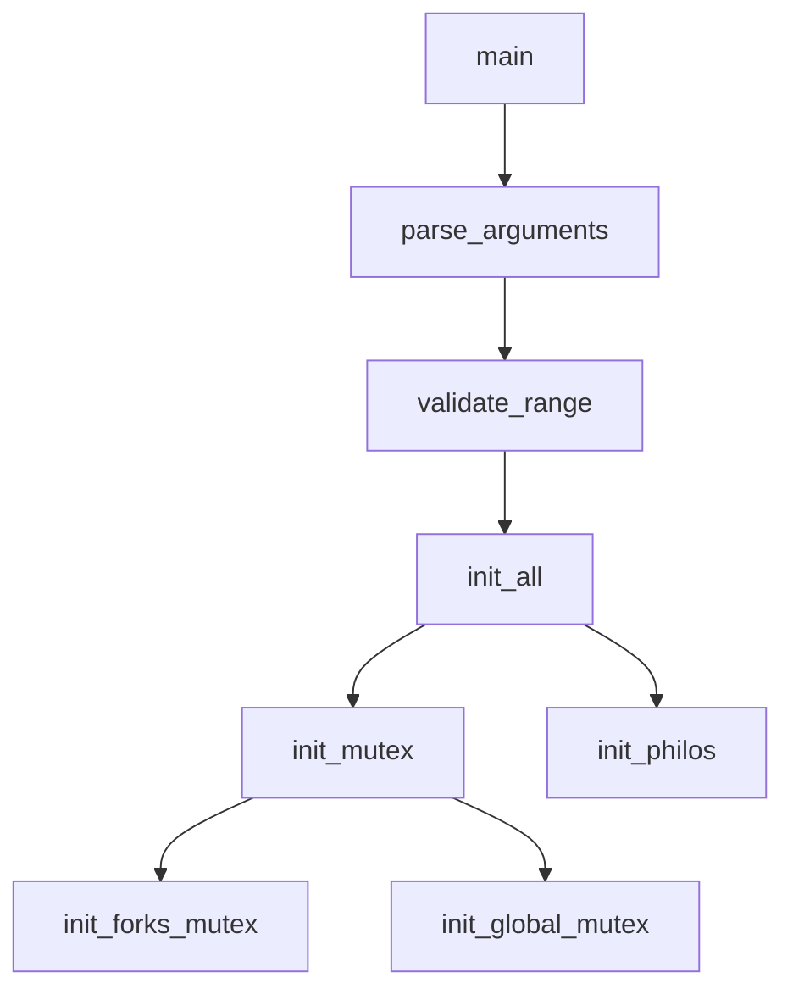

# 📚 Guía Completa del Proyecto Philosophers - Resumen Teórico y Flujo Detallado

## 📖 Índice
1. Conceptos Teóricos Fundamentales
2. Arquitectura del Sistema
3. Flujo Detallado del Programa
4. Patrones de Diseño Implementados
5. Conocimientos Transferibles
6. Casos de Uso Reales
7. Guía de Estudio

---

## 🧠 Conceptos Teóricos Fundamentales

### **1. Concurrencia vs Paralelismo**
- **Concurrencia**: Múltiples tareas progresando aparentemente al mismo tiempo
- **Paralelismo**: Multiple tareas ejecutándose literalmente al mismo tiempo
- **Aplicación**: Los filósofos son threads concurrentes que pueden ejecutarse en paralelo

### **2. Problema del Dining Philosophers**
```
Problema clásico de sincronización que demuestra:
- Deadlock (interbloqueo)
- Starvation (inanición) 
- Race conditions (condiciones de carrera)
- Resource sharing (compartir recursos)
```

### **3. Mutex (Mutual Exclusion)**
```c
pthread_mutex_t mutex;
pthread_mutex_lock(&mutex);   // Sección crítica
// Código protegido
pthread_mutex_unlock(&mutex); // Fin sección crítica
```

**Propósito**: Garantizar acceso exclusivo a recursos compartidos.

### **4. Threads (Hilos)**
```c
pthread_t thread;
pthread_create(&thread, NULL, function, argument);
pthread_join(thread, NULL); // Esperar terminación
```

**Características**:
- Comparten memoria del proceso
- Ejecución independiente
- Requieren sincronización

### **5. Deadlock Prevention**
```
Condiciones para deadlock:
1. Mutual Exclusion
2. Hold and Wait  
3. No Preemption
4. Circular Wait ← ROMPEMOS ESTA
```

**Solución implementada**: Ordenación de recursos (filósofo más alto toma tenedor derecho primero).

---

## 🏗️ Arquitectura del Sistema

### **Estructura de Datos Principal**

```c
// Datos globales de la simulación
typedef struct s_data {
    int num_philos;           // Número de filósofos
    int time_to_die;          // Tiempo límite sin comer
    int time_to_eat;          // Duración de comer
    int time_to_sleep;        // Duración de dormir
    int must_eat_count;       // Comidas objetivo (-1 = infinito)
    long long start_time;     // Timestamp de inicio
    int simulation_end;       // Flag de terminación
    pthread_mutex_t *forks;   // Array de mutexes (tenedores)
    pthread_mutex_t write_mutex;  // Protege printf
    pthread_mutex_t death_mutex; // Protege variables críticas
} t_data;

// Estado individual de cada filósofo
typedef struct s_philo {
    int id;                   // Identificador único
    long long last_meal_time; // Timestamp última comida
    int meals_eaten;          // Contador de comidas
    pthread_t thread;         // Hilo del filósofo
    t_data *data;            // Referencia a datos globales
    pthread_mutex_t *left_fork;  // Tenedor izquierdo
    pthread_mutex_t *right_fork; // Tenedor derecho
} t_philo;
```

### **Patrón de Módulos**

```
main.c          → Entry point y control principal
parsing.c       → Validación y parseo de argumentos
init.c          → Inicialización de estructuras y mutexes
simulation.c    → Lógica de comportamiento de filósofos
monitor.c       → Supervisión de muerte y condiciones de parada
forks.c         → Gestión de recursos compartidos (tenedores)
threads.c       → Creación y gestión de hilos
timing.c        → Sistema de tiempo preciso
logs.c          → Sistema de logging thread-safe
cleanup.c       → Liberación de recursos
utils.c         → Utilidades auxiliares
```

---

## 🔄 Flujo Detallado del Programa

### **Fase 1: Inicialización**



1. **Parseo de Argumentos**:
   ```c
   ./philo num_philos time_to_die time_to_eat time_to_sleep [must_eat_count]
   ```
   - Validación de rango (1-200 filósofos)
   - Conversión a enteros con `ft_atoi`
   - Verificación de números positivos

2. **Inicialización de Mutex**:
   ```c
   // Un mutex por tenedor
   forks = malloc(sizeof(pthread_mutex_t) * num_philos);
   
   // Mutexes globales
   pthread_mutex_init(&write_mutex, NULL);  // Para printf
   pthread_mutex_init(&death_mutex, NULL);  // Para variables críticas
   ```

3. **Configuración de Filósofos**:
   ```c
   philos[i].left_fork = &forks[i];
   philos[i].right_fork = &forks[(i + 1) % num_philos]; // Circular
   ```

### **Fase 2: Arranque de Simulación**

```c
start_simulation():
├── set_initial_times()          // Timestamp inicial
├── pthread_create(monitor)      // Hilo supervisor
├── create_philosopher_threads() // N hilos de filósofos
└── wait_all_threads()          // Esperar terminación
```

### **Fase 3: Bucle de Vida del Filósofo**

```c
philosopher_routine():
├── Initial staggering (pares empiezan pensando)
├── Special case: num_philos == 1
└── Main loop:
    ├── take_forks_safe()     // Tomar tenedores (deadlock-safe)
    ├── print_status("eating")
    ├── eating_action()       // Actualizar last_meal_time
    ├── release_forks()
    ├── print_status("sleeping")
    ├── sleeping_action()
    ├── print_status("thinking")
    └── thinking_action()
```

**Prevención de Deadlock**:
```c
if (philo->id == num_philos) {
    // Filósofo más alto: derecho → izquierdo
    lock(right_fork);
    lock(left_fork);
} else {
    // Resto: izquierdo → derecho
    lock(left_fork);  
    lock(right_fork);
}
```

### **Fase 4: Supervisión (Monitor Thread)**

```c
monitor_routine():
while (!simulation_ended()) {
    ├── find_dead_philosopher()    // Verificar time_to_die
    ├── all_have_eaten_enough()   // Verificar must_eat_count
    └── end_simulation() if needed // Activar flag de parada
}
```

**Detección de Muerte**:
```c
should_die(philo):
current_time = get_time_ms();
lock(death_mutex);
time_since_meal = current_time - philo->last_meal_time;
unlock(death_mutex);
return (time_since_meal >= time_to_die);
```

### **Fase 5: Terminación y Limpieza**

```c
cleanup_all():
├── pthread_join() todos los hilos
├── pthread_mutex_destroy() todos los mutexes  
├── free() memoria dinámica
└── Reset punteros a NULL
```

---

## 🎨 Patrones de Diseño Implementados

### **1. Producer-Consumer Pattern**
- **Filósofos**: Consumers de tenedores
- **Tenedores**: Recursos limitados compartidos
- **Mutex**: Control de acceso exclusivo

### **2. Observer Pattern**
- **Monitor Thread**: Observer que supervisa estado
- **Philosophers**: Subjects observados
- **Events**: Muerte, comidas completadas

### **3. Resource Pool Pattern**
```c
// Pool de tenedores gestionado por mutexes
pthread_mutex_t forks[N];
```

### **4. State Machine Pattern**
```
THINKING → HUNGRY → EATING → SLEEPING → THINKING
    ↑                                        ↓
    ←←←←←←←←←←←←←←←←←←←←←←←←←←←←←←←←←←←←←←←←←←
```

### **5. RAII Pattern (Resource Acquisition Is Initialization)**
```c
init_all() {
    // Adquirir todos los recursos
    if (init_mutex() == -1) return -1;
    if (init_philos() == -1) {
        cleanup_mutex(); // Cleanup automático en error
        return -1;
    }
}
```

---

## 🌍 Conocimientos Transferibles

### **1. Multithreading Concepts (Aplicable a cualquier lenguaje)**

**Java**:
```java
class Philosopher extends Thread {
    private final Object leftFork;
    private final Object rightFork;
    
    public void run() {
        while (!simulationEnded) {
            synchronized(leftFork) {
                synchronized(rightFork) {
                    eat();
                }
            }
            sleep();
            think();
        }
    }
}
```

**Python**:
```python
import threading
import time

class Philosopher(threading.Thread):
    def __init__(self, left_fork, right_fork):
        super().__init__()
        self.left_fork = left_fork
        self.right_fork = right_fork
    
    def run(self):
        while not simulation_ended:
            with self.left_fork:
                with self.right_fork:
                    self.eat()
            self.sleep()
            self.think()
```

**Go**:
```go
func philosopher(id int, leftFork, rightFork chan bool) {
    for !simulationEnded {
        <-leftFork  // Acquire left fork
        <-rightFork // Acquire right fork
        
        eat()
        
        leftFork <- true  // Release left fork
        rightFork <- true // Release right fork
        
        sleep()
        think()
    }
}
```

### **2. Synchronization Patterns**

| C (pthreads) | Java | Python | Go |
|--------------|------|--------|----|
| `pthread_mutex_t` | `synchronized` | `threading.Lock()` | `chan` |
| `pthread_create` | `new Thread()` | `threading.Thread()` | `go routine()` |
| `pthread_join` | `thread.join()` | `thread.join()` | `sync.WaitGroup` |

### **3. Timing Systems**

**Precisión de tiempo** (concepto universal):
```c
// C - Microsegundos
gettimeofday(&tv, NULL);
timestamp = (tv.tv_sec * 1000) + (tv.tv_usec / 1000);

// Java - Nanosegundos  
long timestamp = System.nanoTime() / 1_000_000;

// Python - Milisegundos
import time
timestamp = int(time.time() * 1000)

// Go - Nanosegundos
timestamp := time.Now().UnixNano() / int64(time.Millisecond)
```

### **4. Memory Management Patterns**

```c
// C - Manual
resource = malloc(size);
// ... uso del recurso
free(resource);

// C++ - RAII
std::unique_ptr<Resource> resource = std::make_unique<Resource>();
// Liberación automática al salir del scope

// Java - Garbage Collection
Resource resource = new Resource();
// GC automático

// Rust - Ownership
let resource = Resource::new();
// Drop automático
```

---

## 💼 Casos de Uso Reales

### **1. Web Servers**
```
- Hilos de filósofos → Threads de requests
- Tenedores → Database connections
- Monitor → Health checker
```

### **2. Database Connection Pooling**
```
- Pool de conexiones limitadas
- Múltiples clientes compitiendo
- Timeout de conexiones inactivas
```

### **3. Producer-Consumer Systems**
```
- Sistema de colas de mensajes
- Rate limiting
- Load balancing
```

### **4. Real-time Systems**
```
- Scheduling de tareas críticas
- Resource sharing en embedded systems
- Temporal constraints
```

### **5. Gaming/Simulation**
```
- NPCs con comportamiento concurrente
- Resource management (CPU, GPU, Memory)
- State synchronization en multiplayer
```

---

## 📚 Guía de Estudio

### **Nivel 1: Fundamentos (Principiante)**
1. **Conceptos de Threading**:
   - ¿Qué es un thread?
   - Diferencia proceso vs thread
   - Context switching

2. **Mutual Exclusion**:
   - ¿Por qué necesitamos mutexes?
   - Critical sections
   - Atomic operations

3. **Sincronización Básica**:
   - Lock/Unlock
   - Thread creation/joining

### **Nivel 2: Problemas Clásicos (Intermedio)**
1. **Dining Philosophers**:
   - Entender el problema
   - Identificar deadlock conditions
   - Soluciones de prevención

2. **Race Conditions**:
   - Identificar variables compartidas
   - Proteger secciones críticas
   - Data races vs race conditions

3. **Resource Management**:
   - RAII pattern
   - Exception safety
   - Memory leaks prevention

### **Nivel 3: Optimización (Avanzado)**
1. **Performance Tuning**:
   - Lock contention
   - False sharing
   - Cache coherence

2. **Advanced Patterns**:
   - Lock-free programming
   - Producer-consumer
   - Reader-writer locks

3. **Debugging Concurrency**:
   - Deadlock detection
   - Thread sanitizers
   - Race condition debugging

### **Nivel 4: Sistemas Distribuidos (Experto)**
1. **Distributed Consensus**:
   - CAP theorem
   - Consensus algorithms
   - Byzantine fault tolerance

2. **Scalability**:
   - Horizontal vs vertical scaling
   - Load balancing
   - Microservices patterns

---

## 🔧 Ejercicios Prácticos Recomendados

### **1. Implementar en Otros Lenguajes**
```
- Java: Usando synchronized y ExecutorService
- Python: Con threading y multiprocessing
- Go: Con goroutines y channels
- Rust: Con std::sync y async/await
```

### **2. Variaciones del Problema**
```
- Reader-Writer problem
- Producer-Consumer buffer
- Sleeping Barber problem
- Cigarette Smokers problem
```

### **3. Optimizaciones**
```
- Lock-free implementation
- Priority-based scheduling  
- Resource ordering optimization
- Starvation prevention
```

### **4. Monitoring y Debugging**
```
- Implementar métricas de rendimiento
- Detectar deadlocks automáticamente
- Visualizar estado de threads
- Profiler de concurrencia
```

---

## 🎯 Conclusión

El proyecto **Philosophers** es una introducción completa a la programación concurrente que enseña:

**Conceptos Fundamentales**:
- Thread synchronization
- Deadlock prevention  
- Resource management
- Timing systems

**Patrones de Diseño**:
- Producer-Consumer
- Observer
- State Machine
- RAII

**Habilidades Transferibles**:
- Debugging concurrencia
- Performance optimization
- System design
- Problem decomposition

**Aplicaciones Reales**:
- Web servers
- Database systems
- Real-time systems
- Distributed systems

Este conocimiento es **directamente aplicable** en cualquier lenguaje de programación moderno y es **fundamental** para el desarrollo de sistemas escalables y eficientes.

---


# 📚 Philosophers - Guía Teórica Completa

## 📖 Índice
1. Conceptos Teóricos Fundamentales
2. Estructuras de Datos
3. Funciones Clave
4. Estrategias Anti-Deadlock
5. Gestión de Memoria
6. Timing y Precisión
7. Testing y Validación

---

## 🧠 Conceptos Teóricos Fundamentales

### **El Problema de los Filósofos Comensales**
- **Origen**: Formulado por Edsger Dijkstra en 1965
- **Descripción**: N filósofos sentados en mesa circular, cada uno necesita 2 tenedores para comer
- **Problema**: Evitar deadlock, starvation y race conditions

### **Threading (Hilos)**
```c
pthread_t thread;           // Identificador del hilo
pthread_create(&thread, NULL, routine, arg);  // Crear hilo
pthread_join(thread, NULL); // Esperar que termine
```
- **Concurrencia**: Múltiples hilos ejecutándose "simultáneamente"
- **Paralelismo**: En sistemas multi-core, ejecución real simultánea
- **Context Switching**: El SO alterna entre hilos

### **Mutex (Mutual Exclusion)**
```c
pthread_mutex_t mutex;
pthread_mutex_init(&mutex, NULL);    // Inicializar
pthread_mutex_lock(&mutex);          // Bloquear (adquirir)
pthread_mutex_unlock(&mutex);        // Desbloquear (liberar)
pthread_mutex_destroy(&mutex);       // Destruir
```
- **Propósito**: Proteger secciones críticas
- **Estados**: Libre o bloqueado
- **Bloqueo**: Si un hilo intenta lock() en mutex ocupado, se suspende

### **Race Conditions**
- **Definición**: Resultado depende del timing de hilos
- **Ejemplo**: Dos hilos modificando misma variable simultáneamente
- **Solución**: Mutex para serializar acceso

### **Deadlock**
- **Definición**: Hilos esperándose mutuamente indefinidamente
- **Condiciones necesarias**:
  1. **Mutual Exclusion**: Recursos no compartibles
  2. **Hold and Wait**: Mantener recursos mientras espera otros
  3. **No Preemption**: Recursos no pueden ser forzadamente liberados
  4. **Circular Wait**: Cadena circular de esperas

---

## 🏗️ Estructuras de Datos

### **Estructura Principal (`t_data`)**
```c
typedef struct s_data
{
    int             num_philos;      // Número de filósofos
    int             time_to_die;     // Tiempo máximo sin comer (ms)
    int             time_to_eat;     // Tiempo comiendo (ms)
    int             time_to_sleep;   // Tiempo durmiendo (ms)
    int             must_eat_count;  // Veces que debe comer cada uno (-1 = infinito)
    long long       start_time;     // Timestamp inicio simulación
    int             simulation_end;  // Flag de terminación
    pthread_mutex_t *forks;         // Array de mutex para tenedores
    pthread_mutex_t write_mutex;    // Mutex para printf thread-safe
    pthread_mutex_t death_mutex;    // Mutex para datos críticos
} t_data;
```

### **Estructura del Filósofo (`t_philo`)**
```c
typedef struct s_philo
{
    int             id;             // ID único (1 a N)
    long long       last_meal_time; // Timestamp última comida
    int             meals_eaten;    // Contador de comidas
    pthread_t       thread;         // Hilo del filósofo
    t_data          *data;          // Referencia a datos globales
    pthread_mutex_t *left_fork;     // Puntero a tenedor izquierdo
    pthread_mutex_t *right_fork;    // Puntero a tenedor derecho
} t_philo;
```

**Asignación de Tenedores (Crítica para Anti-Deadlock)**:
```c
(*philos)[i].left_fork = &data->forks[i];
(*philos)[i].right_fork = &data->forks[(i + 1) % data->num_philos];
```
- **Circular**: El último filósofo tiene como tenedor derecho el índice 0
- **Importancia**: Base para estrategia anti-deadlock

---

## 🔧 Funciones Clave

### **1. Parsing y Validación**

#### `parse_arguments`
```c
int parse_arguments(int argc, char **argv, t_data *data)
```
- **Función**: Validar y convertir argumentos de línea de comandos
- **Validaciones**:
  - Número correcto de argumentos (4-5)
  - Solo números positivos
  - Rangos válidos (1-200 filósofos, tiempos > 0)

#### `is_valid_number`
```c
int is_valid_number(char *str)
```
- **Rechaza**: Números negativos, caracteres no numéricos, strings vacíos
- **Acepta**: Solo enteros positivos

### **2. Inicialización**

#### `init_philos` - **CRÍTICA PARA DEADLOCK**
```c
int init_philos(t_philo **philos, t_data *data)
```
- **Asignación circular de tenedores**
- **ID secuenciales**: 1, 2, 3, ..., N
- **Datos iniciales**: `meals_eaten = 0`, `last_meal_time = 0`

#### `init_forks_mutex`
```c
int init_forks_mutex(t_data *data)
```
- **Un mutex por tenedor**
- **Cleanup en caso de error**: Destruye mutex ya inicializados

### **3. Estrategia Anti-Deadlock**

#### `take_forks_safe` - **FUNCIÓN MÁS IMPORTANTE**
```c
void take_forks_safe(t_philo *philo)
{
    if (philo->data->num_philos == 1)
        return; // Caso especial: 1 filósofo
    
    if (philo->id % 2 == 0)  // Filósofos pares
    {
        pthread_mutex_lock(philo->right_fork);  // Primero derecho
        pthread_mutex_lock(philo->left_fork);   // Luego izquierdo
    }
    else  // Filósofos impares
    {
        pthread_mutex_lock(philo->left_fork);   // Primero izquierdo
        pthread_mutex_lock(philo->right_fork);  // Luego derecho
    }
}
```

**¿Por qué funciona?**:
- **Rompe dependencia circular**: No todos siguen mismo orden
- **Previene deadlock**: Imposible que todos esperen en círculo
- **Alternativa válida**: Algunos usan "último filósofo diferente"

### **4. Rutina del Filósofo**

#### `philosopher_routine` - **CORAZÓN DE LA SIMULACIÓN**
```c
void *philosopher_routine(void *arg)
{
    t_philo *philo = (t_philo *)arg;
    
    // Desfase inicial para filósofos pares
    if (philo->id % 2 == 0)
        thinking_action(philo);
    
    // Caso especial: 1 filósofo
    if (philo->data->num_philos == 1) {
        // Solo puede tomar 1 tenedor, debe morir
        return NULL;
    }
    
    // Ciclo principal
    while (!simulation_ended(philo->data)) {
        if (!eat_cycle(philo)) break;
        sleeping_action(philo);
        thinking_action(philo);
    }
    return NULL;
}
```

**Aspectos Clave**:
- **Desfase inicial**: Evita que todos empiecen simultáneamente
- **Verificaciones continuas**: `simulation_ended()` en cada paso
- **Caso 1 filósofo**: Manejado especialmente

### **5. Monitoreo y Muerte**

#### `monitor_routine` - **DETECTOR DE MUERTE**
```c
void *monitor_routine(void *arg)
{
    while (!simulation_ended(data)) {
        // Verificar muertes
        dead_philo = find_dead_philosopher(philos, data);
        if (dead_philo != -1) {
            print_death(&philos[dead_philo]);
            end_simulation(data);
            return NULL;
        }
        
        // Verificar si todos comieron suficiente
        if (all_have_eaten_enough(philos, data)) {
            end_simulation(data);
            return NULL;
        }
        
        usleep(100); // Check cada 0.1ms
    }
}
```

#### `should_die`
```c
int should_die(t_philo *philo)
{
    long long time_since_meal;
    
    pthread_mutex_lock(&philo->data->death_mutex);
    time_since_meal = get_time_ms() - philo->last_meal_time;
    pthread_mutex_unlock(&philo->data->death_mutex);
    
    return (time_since_meal >= philo->data->time_to_die);
}
```

**Protección Thread-Safe**:
- **`death_mutex`**: Protege `last_meal_time` y `meals_eaten`
- **Lectura atómica**: Evita valores inconsistentes

### **6. Timing Preciso**

#### `precise_sleep`
```c
void precise_sleep(long long sleep_time)
{
    long long start = get_time_ms();
    
    while (1) {
        long long elapsed = get_time_ms() - start;
        if (elapsed >= sleep_time) break;
        
        if (sleep_time - elapsed > 1000)
            usleep(500);  // Sleep largo: pasos de 0.5ms
        else
            usleep(50);   // Sleep corto: pasos de 0.05ms
    }
}
```

**¿Por qué no `usleep(sleep_time)`?**:
- **Imprecisión**: `usleep()` puede dormir más tiempo del solicitado
- **Granularidad**: Pasos adaptativos según tiempo restante

---

## 🔒 Estrategias Anti-Deadlock

### **1. Estrategia Implementada: Par/Impar**
```c
if (philo->id % 2 == 0)
    // Par: Derecho → Izquierdo
else
    // Impar: Izquierdo → Derecho
```

### **2. Estrategia Alternativa: Último Filósofo**
```c
if (philo->id == philo->data->num_philos)
    // Último: Derecho → Izquierdo
else
    // Otros: Izquierdo → Derecho
```

### **3. ¿Por qué Funciona?**
- **Dependencia circular rota**: No todos siguen mismo patrón
- **Matemáticamente probado**: Al menos un filósofo puede proceder
- **Ejemplo con 4 filósofos**:
  - F1 (impar): L1 → R1 (que es L2)
  - F2 (par): R2 (que es L3) → L2
  - F3 (impar): L3 → R3 (que es L4)
  - F4 (par): R4 (que es L1) → L4

---

## 🧹 Gestión de Memoria

### **Asignaciones y Liberaciones**
```c
// Asignación
data->forks = malloc(sizeof(pthread_mutex_t) * data->num_philos);
*philos = malloc(sizeof(t_philo) * data->num_philos);

// Liberación
free(data->forks);
free(*philos);
```

### **Cleanup Robusto**
#### `cleanup_all`
```c
void cleanup_all(t_data *data, t_philo **philos)
{
    cleanup_mutex(data);    // Destruir todos los mutex
    cleanup_philos(philos); // Liberar array de filósofos
}
```

**Orden Importante**:
1. **Terminar threads** (`pthread_join`)
2. **Destruir mutex** (`pthread_mutex_destroy`)
3. **Liberar memoria** (`free`)

### **Verificación de Fugas**
```bash
# En macOS
leaks --atExit -- ./philo 5 800 200 200 3

# En Linux
valgrind --leak-check=full ./philo 5 800 200 200 3
```

---

## ⏱️ Timing y Precisión

### **Obtener Tiempo**
```c
long long get_time_ms(void)
{
    struct timeval tv;
    gettimeofday(&tv, NULL);
    return ((tv.tv_sec * 1000) + (tv.tv_usec / 1000));
}
```

### **Sleeping Interruptible**
```c
void sleeping_action(t_philo *philo)
{
    long long start_time = get_time_ms();
    
    while (!simulation_ended(philo->data)) {
        long long elapsed = get_time_ms() - start_time;
        if (elapsed >= philo->data->time_to_sleep)
            break;
        usleep(100);
    }
}
```

**Ventajas**:
- **Interruptible**: Responde a `simulation_ended`
- **Preciso**: No excede tiempo requerido
- **Eficiente**: Checks cada 0.1ms

---

## 🧪 Testing y Validación

### **Pruebas Obligatorias**
```bash
# 1. Un filósofo debe morir
./philo 1 800 200 200

# 2. Nadie debe morir
./philo 5 800 200 200

# 3. Terminar tras N comidas
./philo 5 800 200 200 7

# 4. Caso límite
./philo 4 410 200 200

# 5. Muerte garantizada
./philo 4 310 200 200
```

### **Criterios de Evaluación**

#### **Funcionalidad**
- ✅ **Un thread por filósofo**
- ✅ **Un tenedor por filósofo**  
- ✅ **Un mutex por tenedor**
- ✅ **Outputs no mezclados** (gracias a `write_mutex`)
- ✅ **Detección precisa de muerte** (±10ms)

#### **Rendimiento**
- ⚠️ **No más de 200 filósofos**
- ⚠️ **Tiempos mínimos de 60ms**
- ⚠️ **Precisión en timing**

#### **Memory Management**
- ✅ **Sin fugas de memoria**
- ✅ **Cleanup correcto de mutex**
- ✅ **Liberación en casos de error**

### **Debugging Tips**
```bash
# Verificar threads
ps -M -p $(pgrep philo)

# Monitor de recursos
top -pid $(pgrep philo)

# Race condition testing
for i in {1..100}; do timeout 3s ./philo 5 800 200 200 3; done
```

---

## 🎯 Conceptos Clave para Recordar

### **Thread Safety**
- **Regla**: Todo dato compartido debe estar protegido por mutex
- **Variables críticas**: `last_meal_time`, `meals_eaten`, `simulation_end`
- **Outputs**: `printf` no es thread-safe → `write_mutex`

### **Deadlock Prevention**
- **Estrategia**: Orden diferente de adquisición de recursos
- **Implementación**: Filósofos pares vs impares
- **Alternativa**: Último filósofo con orden inverso

### **Timing Crítico**
- **Precisión**: Usar bucles activos en lugar de `sleep()`
- **Responsividad**: Verificar `simulation_ended` frecuentemente
- **Granularidad**: Pasos pequeños (50-500 microsegundos)

### **Error Handling**
- **Inicialización**: Cleanup parcial si falla a medias
- **Runtime**: Propagar errores hacia arriba
- **Terminación**: Cleanup completo siempre

---

## 🔍 Puntos de Evaluación Críticos

1. **¿Hay exactamente N threads de filósofos?** → Verificar `pthread_create` en bucle
2. **¿Outputs están mezclados?** → `write_mutex` debe proteger todo `printf`
3. **¿Detección de muerte es precisa?** → `should_die` con timing correcto
4. **¿Hay deadlock?** → Estrategia anti-deadlock implementada
5. **¿Hay data races?** → Todos los accesos a datos compartidos protegidos

---

**🎓 Conclusión**: Este proyecto combina conceptos avanzados de sistemas operativos, concurrencia y sincronización. La clave del éxito está en la comprensión profunda de threads, mutex y las sutilezas del timing en sistemas concurrentes.

