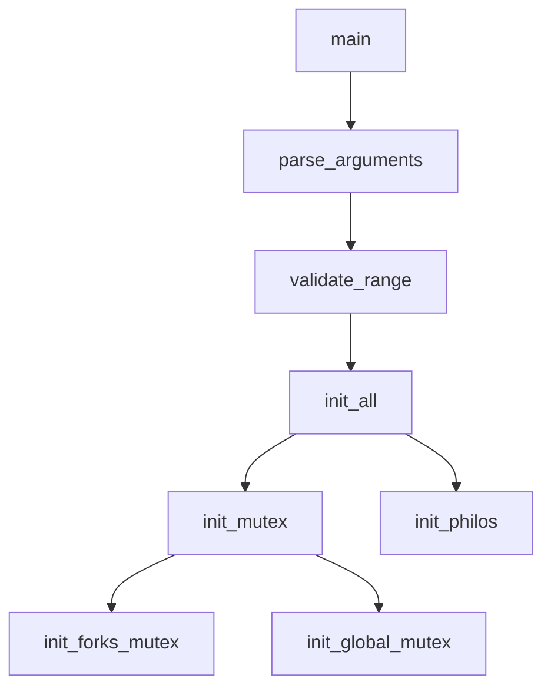

# 📚 Guía Completa del Proyecto Philosophers - Resumen Teórico y Flujo Detallado

## 📖 Índice
1. Conceptos Teóricos Fundamentales
2. Arquitectura del Sistema
3. Flujo Detallado del Programa
4. Patrones de Diseño Implementados
5. Conocimientos Transferibles
6. Casos de Uso Reales
7. Guía de Estudio

---

## 🧠 Conceptos Teóricos Fundamentales

### **1. Concurrencia vs Paralelismo**
- **Concurrencia**: Múltiples tareas progresando aparentemente al mismo tiempo
- **Paralelismo**: Multiple tareas ejecutándose literalmente al mismo tiempo
- **Aplicación**: Los filósofos son threads concurrentes que pueden ejecutarse en paralelo

### **2. Problema del Dining Philosophers**
```
Problema clásico de sincronización que demuestra:
- Deadlock (interbloqueo)
- Starvation (inanición) 
- Race conditions (condiciones de carrera)
- Resource sharing (compartir recursos)
```

### **3. Mutex (Mutual Exclusion)**
```c
pthread_mutex_t mutex;
pthread_mutex_lock(&mutex);   // Sección crítica
// Código protegido
pthread_mutex_unlock(&mutex); // Fin sección crítica
```

**Propósito**: Garantizar acceso exclusivo a recursos compartidos.

### **4. Threads (Hilos)**
```c
pthread_t thread;
pthread_create(&thread, NULL, function, argument);
pthread_join(thread, NULL); // Esperar terminación
```

**Características**:
- Comparten memoria del proceso
- Ejecución independiente
- Requieren sincronización

### **5. Deadlock Prevention**
```
Condiciones para deadlock:
1. Mutual Exclusion
2. Hold and Wait  
3. No Preemption
4. Circular Wait ← ROMPEMOS ESTA
```

**Solución implementada**: Ordenación de recursos (filósofo más alto toma tenedor derecho primero).

---

## 🏗️ Arquitectura del Sistema

### **Estructura de Datos Principal**

```c
// Datos globales de la simulación
typedef struct s_data {
    int num_philos;           // Número de filósofos
    int time_to_die;          // Tiempo límite sin comer
    int time_to_eat;          // Duración de comer
    int time_to_sleep;        // Duración de dormir
    int must_eat_count;       // Comidas objetivo (-1 = infinito)
    long long start_time;     // Timestamp de inicio
    int simulation_end;       // Flag de terminación
    pthread_mutex_t *forks;   // Array de mutexes (tenedores)
    pthread_mutex_t write_mutex;  // Protege printf
    pthread_mutex_t death_mutex; // Protege variables críticas
} t_data;

// Estado individual de cada filósofo
typedef struct s_philo {
    int id;                   // Identificador único
    long long last_meal_time; // Timestamp última comida
    int meals_eaten;          // Contador de comidas
    pthread_t thread;         // Hilo del filósofo
    t_data *data;            // Referencia a datos globales
    pthread_mutex_t *left_fork;  // Tenedor izquierdo
    pthread_mutex_t *right_fork; // Tenedor derecho
} t_philo;
```

### **Patrón de Módulos**

```
main.c          → Entry point y control principal
parsing.c       → Validación y parseo de argumentos
init.c          → Inicialización de estructuras y mutexes
simulation.c    → Lógica de comportamiento de filósofos
monitor.c       → Supervisión de muerte y condiciones de parada
forks.c         → Gestión de recursos compartidos (tenedores)
threads.c       → Creación y gestión de hilos
timing.c        → Sistema de tiempo preciso
logs.c          → Sistema de logging thread-safe
cleanup.c       → Liberación de recursos
utils.c         → Utilidades auxiliares
```

---

## 🔄 Flujo Detallado del Programa

### **Fase 1: Inicialización**



1. **Parseo de Argumentos**:
   ```c
   ./philo num_philos time_to_die time_to_eat time_to_sleep [must_eat_count]
   ```
   - Validación de rango (1-200 filósofos)
   - Conversión a enteros con `ft_atoi`
   - Verificación de números positivos

2. **Inicialización de Mutex**:
   ```c
   // Un mutex por tenedor
   forks = malloc(sizeof(pthread_mutex_t) * num_philos);
   
   // Mutexes globales
   pthread_mutex_init(&write_mutex, NULL);  // Para printf
   pthread_mutex_init(&death_mutex, NULL);  // Para variables críticas
   ```

3. **Configuración de Filósofos**:
   ```c
   philos[i].left_fork = &forks[i];
   philos[i].right_fork = &forks[(i + 1) % num_philos]; // Circular
   ```

### **Fase 2: Arranque de Simulación**

```c
start_simulation():
├── set_initial_times()          // Timestamp inicial
├── pthread_create(monitor)      // Hilo supervisor
├── create_philosopher_threads() // N hilos de filósofos
└── wait_all_threads()          // Esperar terminación
```

### **Fase 3: Bucle de Vida del Filósofo**

```c
philosopher_routine():
├── Initial staggering (pares empiezan pensando)
├── Special case: num_philos == 1
└── Main loop:
    ├── take_forks_safe()     // Tomar tenedores (deadlock-safe)
    ├── print_status("eating")
    ├── eating_action()       // Actualizar last_meal_time
    ├── release_forks()
    ├── print_status("sleeping")
    ├── sleeping_action()
    ├── print_status("thinking")
    └── thinking_action()
```

**Prevención de Deadlock**:
```c
if (philo->id == num_philos) {
    // Filósofo más alto: derecho → izquierdo
    lock(right_fork);
    lock(left_fork);
} else {
    // Resto: izquierdo → derecho
    lock(left_fork);  
    lock(right_fork);
}
```

### **Fase 4: Supervisión (Monitor Thread)**

```c
monitor_routine():
while (!simulation_ended()) {
    ├── find_dead_philosopher()    // Verificar time_to_die
    ├── all_have_eaten_enough()   // Verificar must_eat_count
    └── end_simulation() if needed // Activar flag de parada
}
```

**Detección de Muerte**:
```c
should_die(philo):
current_time = get_time_ms();
lock(death_mutex);
time_since_meal = current_time - philo->last_meal_time;
unlock(death_mutex);
return (time_since_meal >= time_to_die);
```

### **Fase 5: Terminación y Limpieza**

```c
cleanup_all():
├── pthread_join() todos los hilos
├── pthread_mutex_destroy() todos los mutexes  
├── free() memoria dinámica
└── Reset punteros a NULL
```

---

## 🎨 Patrones de Diseño Implementados

### **1. Producer-Consumer Pattern**
- **Filósofos**: Consumers de tenedores
- **Tenedores**: Recursos limitados compartidos
- **Mutex**: Control de acceso exclusivo

### **2. Observer Pattern**
- **Monitor Thread**: Observer que supervisa estado
- **Philosophers**: Subjects observados
- **Events**: Muerte, comidas completadas

### **3. Resource Pool Pattern**
```c
// Pool de tenedores gestionado por mutexes
pthread_mutex_t forks[N];
```

### **4. State Machine Pattern**
```
THINKING → HUNGRY → EATING → SLEEPING → THINKING
    ↑                                        ↓
    ←←←←←←←←←←←←←←←←←←←←←←←←←←←←←←←←←←←←←←←←←←
```

### **5. RAII Pattern (Resource Acquisition Is Initialization)**
```c
init_all() {
    // Adquirir todos los recursos
    if (init_mutex() == -1) return -1;
    if (init_philos() == -1) {
        cleanup_mutex(); // Cleanup automático en error
        return -1;
    }
}
```

---

## 🌍 Conocimientos Transferibles

### **1. Multithreading Concepts (Aplicable a cualquier lenguaje)**

**Java**:
```java
class Philosopher extends Thread {
    private final Object leftFork;
    private final Object rightFork;
    
    public void run() {
        while (!simulationEnded) {
            synchronized(leftFork) {
                synchronized(rightFork) {
                    eat();
                }
            }
            sleep();
            think();
        }
    }
}
```

**Python**:
```python
import threading
import time

class Philosopher(threading.Thread):
    def __init__(self, left_fork, right_fork):
        super().__init__()
        self.left_fork = left_fork
        self.right_fork = right_fork
    
    def run(self):
        while not simulation_ended:
            with self.left_fork:
                with self.right_fork:
                    self.eat()
            self.sleep()
            self.think()
```

**Go**:
```go
func philosopher(id int, leftFork, rightFork chan bool) {
    for !simulationEnded {
        <-leftFork  // Acquire left fork
        <-rightFork // Acquire right fork
        
        eat()
        
        leftFork <- true  // Release left fork
        rightFork <- true // Release right fork
        
        sleep()
        think()
    }
}
```

### **2. Synchronization Patterns**

| C (pthreads) | Java | Python | Go |
|--------------|------|--------|----|
| `pthread_mutex_t` | `synchronized` | `threading.Lock()` | `chan` |
| `pthread_create` | `new Thread()` | `threading.Thread()` | `go routine()` |
| `pthread_join` | `thread.join()` | `thread.join()` | `sync.WaitGroup` |

### **3. Timing Systems**

**Precisión de tiempo** (concepto universal):
```c
// C - Microsegundos
gettimeofday(&tv, NULL);
timestamp = (tv.tv_sec * 1000) + (tv.tv_usec / 1000);

// Java - Nanosegundos  
long timestamp = System.nanoTime() / 1_000_000;

// Python - Milisegundos
import time
timestamp = int(time.time() * 1000)

// Go - Nanosegundos
timestamp := time.Now().UnixNano() / int64(time.Millisecond)
```

### **4. Memory Management Patterns**

```c
// C - Manual
resource = malloc(size);
// ... uso del recurso
free(resource);

// C++ - RAII
std::unique_ptr<Resource> resource = std::make_unique<Resource>();
// Liberación automática al salir del scope

// Java - Garbage Collection
Resource resource = new Resource();
// GC automático

// Rust - Ownership
let resource = Resource::new();
// Drop automático
```

---

## 💼 Casos de Uso Reales

### **1. Web Servers**
```
- Hilos de filósofos → Threads de requests
- Tenedores → Database connections
- Monitor → Health checker
```

### **2. Database Connection Pooling**
```
- Pool de conexiones limitadas
- Múltiples clientes compitiendo
- Timeout de conexiones inactivas
```

### **3. Producer-Consumer Systems**
```
- Sistema de colas de mensajes
- Rate limiting
- Load balancing
```

### **4. Real-time Systems**
```
- Scheduling de tareas críticas
- Resource sharing en embedded systems
- Temporal constraints
```

### **5. Gaming/Simulation**
```
- NPCs con comportamiento concurrente
- Resource management (CPU, GPU, Memory)
- State synchronization en multiplayer
```

---

## 📚 Guía de Estudio

### **Nivel 1: Fundamentos (Principiante)**
1. **Conceptos de Threading**:
   - ¿Qué es un thread?
   - Diferencia proceso vs thread
   - Context switching

2. **Mutual Exclusion**:
   - ¿Por qué necesitamos mutexes?
   - Critical sections
   - Atomic operations

3. **Sincronización Básica**:
   - Lock/Unlock
   - Thread creation/joining

### **Nivel 2: Problemas Clásicos (Intermedio)**
1. **Dining Philosophers**:
   - Entender el problema
   - Identificar deadlock conditions
   - Soluciones de prevención

2. **Race Conditions**:
   - Identificar variables compartidas
   - Proteger secciones críticas
   - Data races vs race conditions

3. **Resource Management**:
   - RAII pattern
   - Exception safety
   - Memory leaks prevention

### **Nivel 3: Optimización (Avanzado)**
1. **Performance Tuning**:
   - Lock contention
   - False sharing
   - Cache coherence

2. **Advanced Patterns**:
   - Lock-free programming
   - Producer-consumer
   - Reader-writer locks

3. **Debugging Concurrency**:
   - Deadlock detection
   - Thread sanitizers
   - Race condition debugging

### **Nivel 4: Sistemas Distribuidos (Experto)**
1. **Distributed Consensus**:
   - CAP theorem
   - Consensus algorithms
   - Byzantine fault tolerance

2. **Scalability**:
   - Horizontal vs vertical scaling
   - Load balancing
   - Microservices patterns

---

## 🔧 Ejercicios Prácticos Recomendados

### **1. Implementar en Otros Lenguajes**
```
- Java: Usando synchronized y ExecutorService
- Python: Con threading y multiprocessing
- Go: Con goroutines y channels
- Rust: Con std::sync y async/await
```

### **2. Variaciones del Problema**
```
- Reader-Writer problem
- Producer-Consumer buffer
- Sleeping Barber problem
- Cigarette Smokers problem
```

### **3. Optimizaciones**
```
- Lock-free implementation
- Priority-based scheduling  
- Resource ordering optimization
- Starvation prevention
```

### **4. Monitoring y Debugging**
```
- Implementar métricas de rendimiento
- Detectar deadlocks automáticamente
- Visualizar estado de threads
- Profiler de concurrencia
```

---

## 🎯 Conclusión

El proyecto **Philosophers** es una introducción completa a la programación concurrente que enseña:

**Conceptos Fundamentales**:
- Thread synchronization
- Deadlock prevention  
- Resource management
- Timing systems

**Patrones de Diseño**:
- Producer-Consumer
- Observer
- State Machine
- RAII

**Habilidades Transferibles**:
- Debugging concurrencia
- Performance optimization
- System design
- Problem decomposition

**Aplicaciones Reales**:
- Web servers
- Database systems
- Real-time systems
- Distributed systems

Este conocimiento es **directamente aplicable** en cualquier lenguaje de programación moderno y es **fundamental** para el desarrollo de sistemas escalables y eficientes.

---
